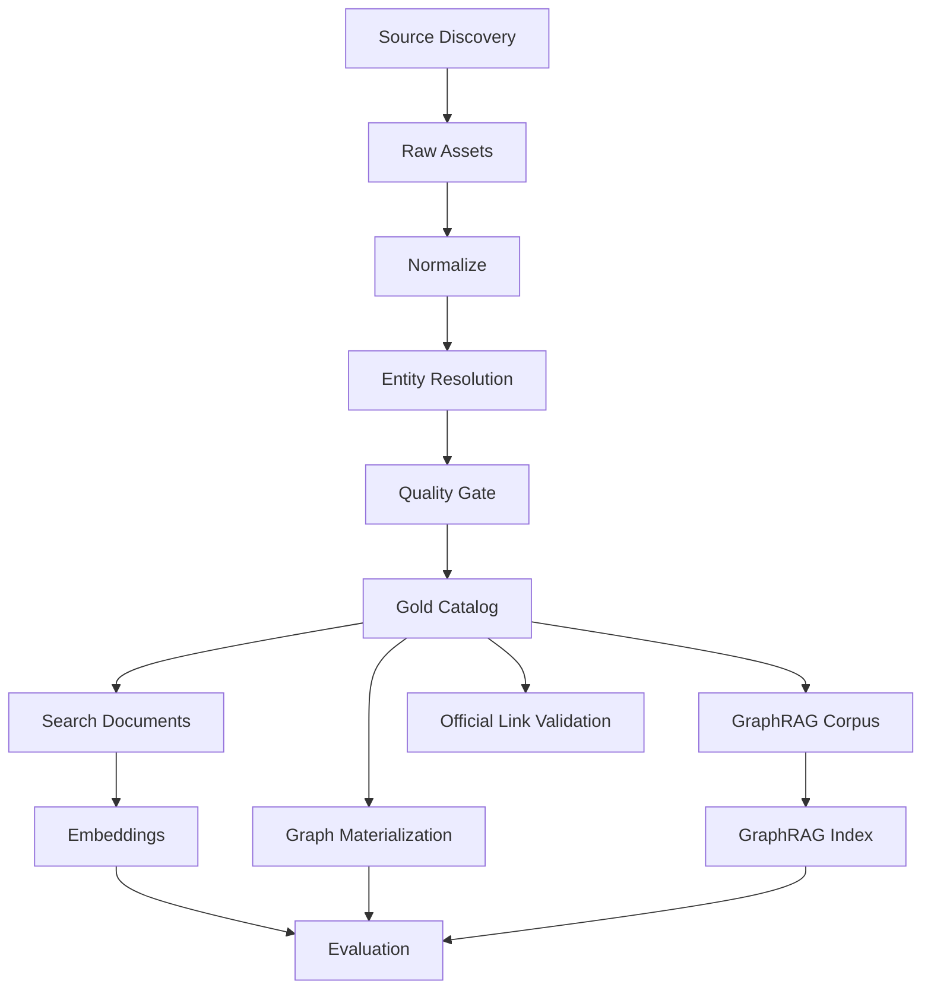

# Airflow DAG Design

## 1. 기준

2026-09-26 기준 Apache Airflow 3.3.x 문서의 Asset-Aware Scheduling과 Event-driven Scheduling을 기준으로 설계한다.

핵심 원칙:

- 데이터 의존성은 가능하면 **Asset**으로 표현한다.
- 외부 변경 이벤트가 있는 경우 `AssetWatcher` / event-driven scheduling을 고려한다.
- 단순 시간성 작업은 cron/timetable이 더 명확하면 그대로 사용한다.
- API request 경로에 Airflow를 사용하지 않는다.
- 모든 pipeline은 idempotent하게 만든다.

---

## 2. Asset Catalog

```text
asset://raw/drama/{source}
asset://raw/person/{source}
asset://raw/ost/{source}

asset://silver/drama
asset://silver/person
asset://silver/ost

asset://gold/catalog
asset://gold/official_links

asset://search/documents
asset://search/embeddings

asset://graph/canonical
asset://graphrag/corpus
asset://graphrag/index

asset://eval/golden_queries
asset://eval/search_report
```

---

## 3. Pipeline Map



---

# 4. DAG: `source_discovery_daily`

## 목적

신규/변경 작품 URL 또는 source external ID를 탐색한다.

## Schedule

source별로 차등.

```text
active/current season source: 6h ~ daily
historical archive source: weekly
```

## Tasks

```text
discover_source_pages
  → deduplicate_urls
  → diff_previous_manifest
  → emit_discovery_manifest
```

## Output

`asset://raw/discovery/{source}`

## 실패 정책

source layout이 크게 변경돼 결과 수가 급감하면 publish하지 않는다.

Quality rule 예:

```text
current_count < previous_7d_median * 0.6
→ fail + alert
```

## 구현 현황 — `source_discovery_wikidata` (주간)

후보를 두 목록에서 모으고, 하나의 판정으로 거른다.

```text
Wikidata SPARQL  시리즈류 클래스(TV 시리즈·웹 시리즈·미니시리즈·시즌·TV 영화 …) × 제작국 한국 × 방영 시작 ≥ year_from
kowiki 분류      분류:{연도}년 텔레비전 드라마 (2006 ~ 내년) 멤버 중 분류에 한국/한국 채널이 있는 문서 → wikibase_item
  → 합집합 → DETAILS 배치 질의(P31 클래스, P136 장르 라벨, P495 제작국, kowiki 문서)
  → program_kind.classify(): DRAMA / NOT_DRAMA / UNKNOWN
  → UNKNOWN + kowiki 문서 있음 → 문서 분류 조회(50건/요청) 후 재판정
```

Wikidata의 "television series" 클래스에는 예능·리얼리티가 섞여 있어(《런닝맨》, 《스트릿댄스 걸스 파이터》) 클래스만으로는 걸러지지 않는다. 판정 신호는 `normalization/program_kind.py`에 결정적으로 적혀 있고 파서·품질 게이트도 같은 규칙을 쓴다: 사람이 관리하는 kowiki "…드라마" 분류 > Wikidata 클래스(버라이어티·토크쇼·에피소드·목록 문서는 항상 제외, 영화·만화는 시리즈 클래스가 없을 때만 제외) > 장르 라벨(드라마/스릴러/로맨스… vs 리얼리티/버라이어티/토크/음악 프로그램/다큐/경연…).

출력:

```text
manifests/wikidata/latest.json     DRAMA + UNKNOWN 항목 (kind 포함), 날짜별 사본
manifests/wikidata/excluded.json   NOT_DRAMA / foreign 항목과 근거
```

`publish_gold_catalog.retire_excluded`가 매 실행마다 `excluded.json`에 있는 이미 발행된 작품을 `HIDDEN`으로(outbox `DRAMA_HIDDEN`), 다시 manifest에 들어온 작품을 `PUBLISHED`로 되돌린다. search_document·graph 프로젝션은 PUBLISHED만 보므로 자동으로 빠진다.

---

# 5. DAG: `ingest_source_records`

## Input

`asset://raw/discovery/{source}`

## Tasks

```text
fetch
 → validate_http
 → content_hash
 → write_object_storage
 → write_source_record
 → emit_raw_asset
```

## Idempotency key

```text
source_id + external_id + content_hash
```

같은 콘텐츠는 중복 snapshot record 생성을 피한다.

---

# 6. DAG: `normalize_catalog`

## Input

raw drama/person/ost asset

## Tasks

```text
parse
 → normalize_strings
 → normalize_dates
 → normalize_urls
 → validate_schema
 → write_staging
```

### 정규화 예

```text
"  도깨비 "      → "도깨비"
"tvN "           → "tvn"
"2016.12.02"     → 2016-12-02
```

parser 결과에는 항상 `parser_version`을 남긴다.

---

# 7. DAG: `entity_resolution`

## Input

Silver records

## Flow

```text
candidate_generation
 → deterministic_match
 → feature_scoring
 → classify_match
 ├─ AUTO_MERGE
 ├─ REVIEW
 └─ CREATE_NEW
```

## Candidate generation

- exact normalized title/name
- date/year
- broadcaster
- shared credits
- external identifier

LLM은 최종 canonical ID를 임의로 생성하는 주체가 아니다.

---

# 8. DAG: `catalog_quality_gate`

## Checks

### Completeness

```text
title != null
source_url != null
source_record != null
```

### Referential integrity

```text
credit.person exists
credit.drama exists
drama_ost.song exists
```

### Semantic rules

```text
start_date <= end_date
episode_count > 0
```

### Distribution drift

- 작품 수 급감
- 출연진 평균 수 급변
- unknown broadcaster 증가
- parser null rate 상승

Critical 실패 시 Gold publish를 중지한다.

---

# 9. DAG: `publish_gold_catalog`

staging → canonical merge.

권장 패턴:

```text
BEGIN
  create/update canonical rows
  write provenance
  increment canonical_version
  insert outbox/domain change event
COMMIT
```

---

# 10. DAG: `official_link_validator`

## Schedule

daily.

## Tasks

```text
load_links
 → partition_by_provider
 → HEAD/GET validation
 → redirect_canonicalization
 → classify_result
 → update_status
```

### status

```text
AVAILABLE
REDIRECTED
NOT_FOUND
ACCESS_DENIED
REGION_RESTRICTED
TEMPORARY_ERROR
UNKNOWN
```

403만 보고 바로 dead link로 판단하지 않는다.

provider별 validation adapter를 둔다.

---

# 11. DAG: `search_document_build`

## Trigger

`asset://gold/catalog` updated.

## Flow

```text
load_changed_entities
 → render_search_documents
 → content_hash
 → compare_previous
 → upsert_documents
 → emit asset://search/documents
```

Search document 예:

```text
제목: 도깨비
방송사: tvN
연도: 2016
장르: 판타지, 로맨스
출연: 공유, 김고은, 이동욱, 유인나
OST: Stay With Me ...
설명: ...
```

---

# 12. DAG: `embedding_refresh`

## Trigger

`asset://search/documents`

## Flow

```text
select_changed_docs
 → batch_embedding
 → validate_dimension
 → upsert_embedding
 → record_model_version
```

재임베딩 조건:

- content hash changed
- embedding model changed
- embedding prompt/template changed

전체 재임베딩은 비용이 크므로 명시적인 migration job으로 처리한다.

---

# 13. DAG: `graph_materialization`

## Trigger

canonical Gold 변경.

## Strategy

PostgreSQL change set으로 Neo4j projection을 갱신한다.

```text
extract_changed_nodes
 → upsert_nodes
 → extract_changed_edges
 → upsert_edges
 → remove_stale_edges
 → integrity_test
```

### 중요한 규칙

Neo4j ID를 canonical identity로 외부에 노출하지 않는다.

Node:

```text
(:Drama {canonical_id: 123})
```

---

# 14. DAG: `graphrag_corpus_build`

GraphRAG는 structured canonical data를 다시 LLM으로 추출하는 도구가 아니다.

Corpus 후보:

- 자체 작성 설명
- 합법적으로 사용할 수 있는 공식/편집 텍스트
- 공개 사용자가 작성한 공개 메모 중 정책 통과 콘텐츠
- 시대/테마 editorial

Tasks:

```text
select_documents
 → sanitize
 → remove_private_data
 → chunk
 → assign_document_ids
 → publish_corpus
```

---

# 15. DAG: `graphrag_index`

## Trigger

corpus change threshold 또는 nightly/weekly.

Microsoft GraphRAG 표준 pipeline의 목적:

- entity/relationship extraction
- community detection
- community summary/report
- text embedding

## 실행 정책

```text
minor corpus change → incremental/custom partial strategy
large structural change → rebuild
```

GraphRAG 버전/설정 변경 시 index artifact version을 반드시 바꾼다.

---

# 16. DAG: `search_evaluation_nightly`

## Input

- golden query dataset
- current index version

## Output

- Recall@K
- MRR
- NDCG
- route accuracy
- latency
- failure samples

regression threshold 예:

```text
Recall@10 drop > 3 percentage points → block promotion
```

절대값은 benchmark 구축 후 확정한다.

---

# 17. DAG: `graphrag_evaluation_weekly`

Vector-only / Graph-only / Hybrid / GraphRAG 비교.

질문을 query class로 분리한다.

```text
entity_lookup
semantic_memory
multi_hop
global_theme
temporal
```

GraphRAG가 baseline보다 개선하지 못하는 class에는 사용하지 않는다.

---

# 17a. DAG: `anonymous_user_cleanup`

## Schedule

daily.

## 목적

[ADR-011](ADR/ADR-011-guest-first-auth.md) §6 보유기간 정책. 익명 사용자는 마지막 활동 후 90일이 지나면 삭제한다.

## Tasks

```text
select_expired_anonymous_users
  (anonymous = true AND status = 'ACTIVE' AND last_active_at < now() - interval '90 days')
 → delete_in_batches        -- user_drama_state / memory_note / consent는 cascade
 → record_metrics           -- deleted_count, oldest_remaining
```

## 규칙

- 로그인 사용자(`anonymous = false`)는 절대 대상이 아니다.
- `MERGED` 계정은 병합 시점에 이미 정리되므로 대상이 아니다.
- 배치 크기를 제한해 online write path에 lock 영향이 없게 한다.

---

# 18. DAG Dependency Example

```python
from airflow.sdk import Asset

gold_catalog = Asset("asset://gold/catalog")
search_documents = Asset("asset://search/documents")
graph_canonical = Asset("asset://graph/canonical")

# producer task:
# outlets=[gold_catalog]

# downstream DAG:
# schedule=[gold_catalog]
```

실제 Airflow SDK import와 operator API는 프로젝트에서 고정한 Airflow minor version에 맞춰 lock한다.

---

# 19. Backfill

과거 연도 전체 ingest는 production daily DAG와 분리한다.

```text
historical_backfill
  params:
    broadcaster
    year_from
    year_to
    dry_run
```

rate limit을 source 정책에 맞게 제한한다.

---

# 20. Retries

### network fetch

```text
retry: exponential backoff
max retries: source별
```

### parser failure

같은 payload에 무한 retry하지 않는다.

```text
parser error
→ dead-letter/review
```

### embedding provider

batch를 작은 단위로 checkpoint한다.

---

# 21. Pool / Concurrency

Airflow Pool 예:

```text
source_kbs_pool
source_mbc_pool
embedding_api_pool
neo4j_write_pool
```

외부 서비스에 무제한 요청하지 않는다.

---

# 22. Data Lineage

최종 Drama row가 어디서 왔는지 추적 가능해야 한다.

```text
source URL
→ raw object
→ source_record
→ staging record
→ canonical entity
→ search_document
→ embedding
→ graph node
```

---

# 23. Alerting

Pager급:

- Gold publish 24h 이상 실패
- canonical corruption
- DB unavailable

Slack/issue급:

- 특정 source parser failure 증가
- dead official link 증가
- entity review queue 증가
- eval metric regression

---

# 24. References

- Asset-Aware Scheduling  
  https://airflow.apache.org/docs/apache-airflow/stable/authoring-and-scheduling/asset-scheduling.html
- Event-driven Scheduling  
  https://airflow.apache.org/docs/apache-airflow/stable/authoring-and-scheduling/event-scheduling.html
