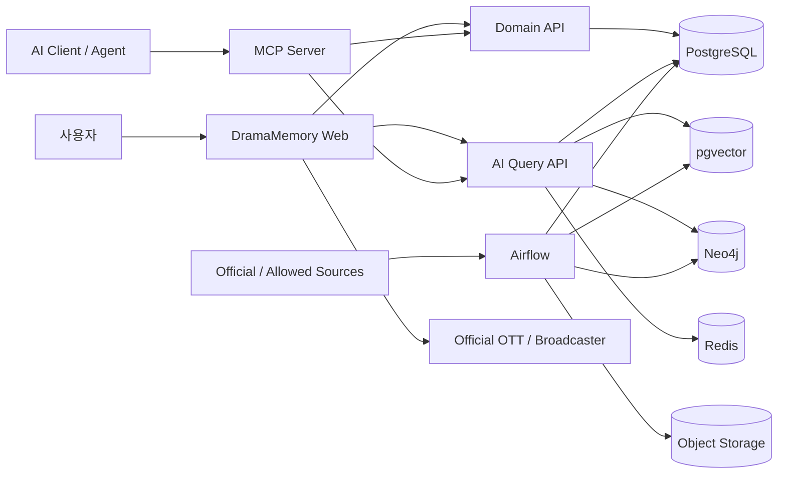
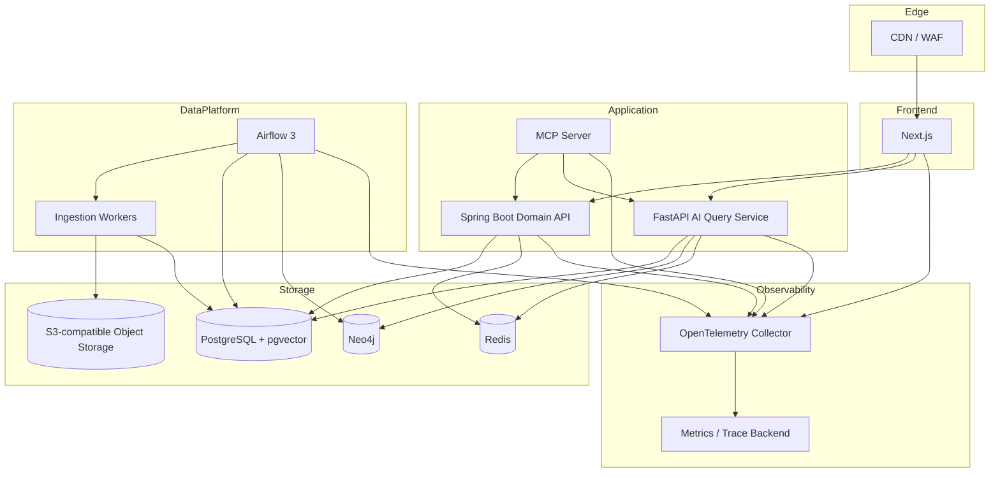
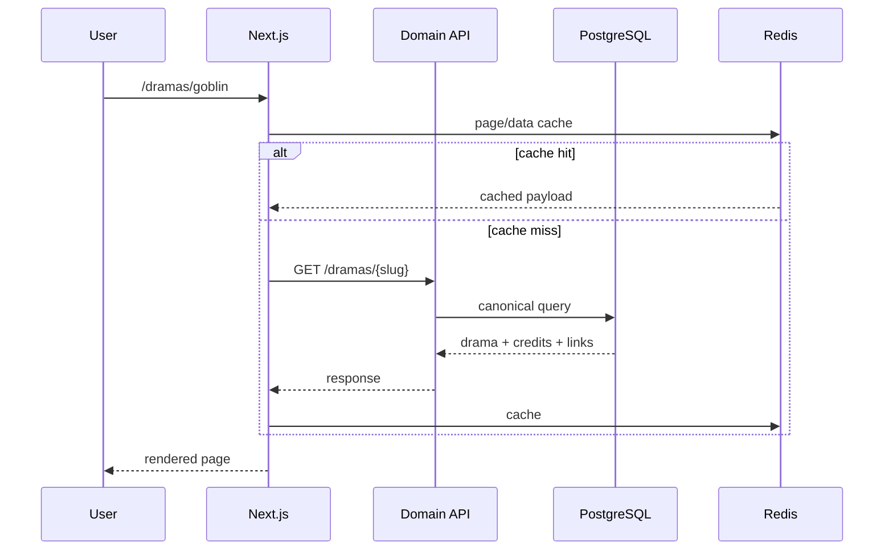
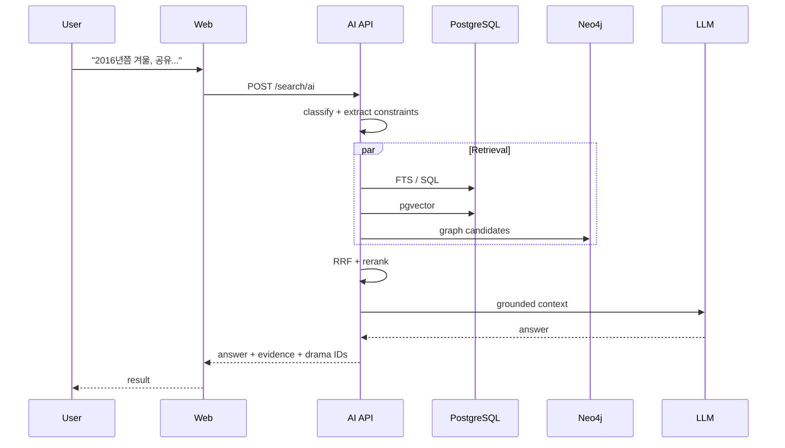
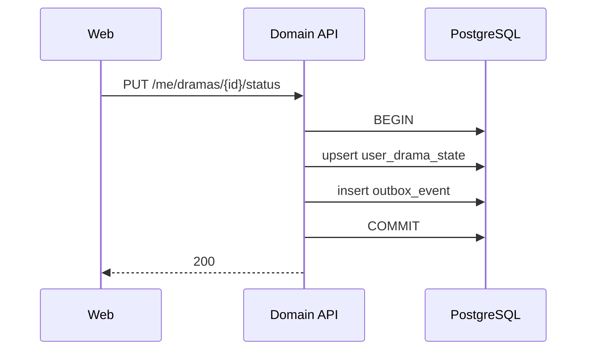
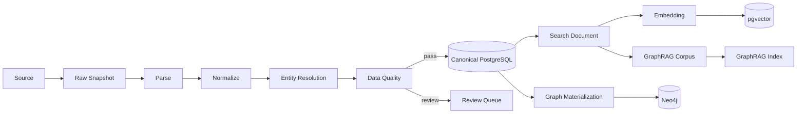

# Architecture

## 1. 목적

DramaMemory의 아키텍처는 세 가지 서로 다른 workload를 분리한다.

1. **Transactional workload** — 로그인, 봤어요, 메모, 관리자 수정
2. **Data workload** — 수집, 정제, entity resolution, link validation, indexing
3. **AI/Search workload** — lexical/vector/graph retrieval, reranking, generation

이 셋을 처음부터 하나의 서비스에 섞으면 배치 작업과 AI 요청이 사용자 트랜잭션에 영향을 주기 쉽다. 반대로 너무 많은 마이크로서비스로 쪼개면 초기 운영 복잡도가 제품 가치보다 커진다.

따라서 초기 경계는 아래 세 개만 명확히 둔다.

- `web`
- `domain-api`
- `ai-api`

Airflow와 MCP는 각각 batch orchestration / agent interoperability 역할이다.

---

## 2. System Context



---

## 3. Container View



---

## 4. Component Responsibilities

### 4.1 Next.js Web

책임:

- 연도/방송사/배우/OST 공개 페이지
- SEO metadata
- SSR/ISR
- 로그인 UX
- Timeline
- AI memory search UI
- graph visualization

하지 않는 일:

- canonical business logic
- embedding 생성
- GraphRAG indexing

### 4.2 Spring Boot Domain API

책임:

- User/Auth
- Watched/Watching/Want-to-watch
- MemoryNote
- Admin
- transactional validation
- canonical read API
- outbox

중요 규칙:

> 사용자가 `봤어요`를 누르는 write path는 AI subsystem 상태와 무관하게 동작해야 한다.

### 4.3 FastAPI AI Query Service

책임:

- query classification
- metadata extraction
- FTS/vector/graph retrieval
- RRF fusion
- reranking
- context building
- RAG generation
- GraphRAG query adapter
- retrieval/eval instrumentation

FastAPI는 canonical domain write를 직접 소유하지 않는다.

### 4.4 Airflow

책임:

- external source ingestion
- raw snapshot
- normalization
- entity resolution
- data quality
- link validation
- embedding refresh
- Neo4j materialization
- GraphRAG offline index build
- evaluation scheduling

Airflow는 API request orchestration 도구가 아니다.

### 4.5 PostgreSQL + pgvector

PostgreSQL은 **System of Record**다.

보관:

- canonical drama/person/song
- credits
- source mapping
- user state
- provenance
- ingestion status
- outbox
- search documents
- embeddings

pgvector는 초기 semantic search를 같은 DB에 유지한다.

### 4.6 Neo4j

역할:

- 관계 traversal
- graph feature
- graph visualization
- Graph-aware retrieval

Neo4j는 derived read model이다. 삭제되더라도 PostgreSQL에서 재생성 가능해야 한다.

### 4.7 Object Storage

원본 응답을 immutable snapshot으로 저장한다.

예:

```text
s3://dramamemory-raw/
  broadcaster=kbs/
  entity=drama/
  dt=2026-09-26/
  {content_hash}.json
```

효과:

- parser bug 재처리
- source 변경 비교
- audit
- reproducibility

---

## 5. Online Request Flows

### 5.1 일반 상세 페이지



### 5.2 AI Memory Search



### 5.3 `봤어요`



AI 또는 Neo4j 장애와 독립적이어야 한다.

---

## 6. Data Pipeline Flow



---

## 7. Consistency Model

### Strong consistency

- user state
- memory note
- admin canonical edits

### Eventual consistency

- vector index
- Neo4j
- SEO aggregate
- GraphRAG community
- analytics

UI에서 graph/vector lag가 있더라도 사용자 write가 실패하면 안 된다.

---

## 8. Cache Strategy

### Redis key examples

```text
drama:v3:{id}
actor:v2:{id}
year:v4:{year}:{filters_hash}
search:v5:{normalized_query_hash}
graph:v2:{entity_id}:{relation}:{depth}
```

AI cache에는 반드시 아래 버전을 포함한다.

```text
retrieval_version
embedding_model_version
reranker_version
prompt_version
data_snapshot_version
```

---

## 9. Observability

OpenTelemetry span 예:

```text
http.request
 ├─ auth
 ├─ query.classify
 ├─ retrieve.sql
 ├─ retrieve.vector
 ├─ retrieve.graph
 ├─ fusion.rrf
 ├─ rerank
 ├─ context.build
 └─ llm.generate
```

주요 attributes:

- `query.type`
- `retrieval.strategy`
- `candidate.count`
- `embedding.model`
- `reranker.model`
- `llm.model`
- `input.tokens`
- `output.tokens`
- `estimated.cost`
- `cache.hit`
- `result.drama_ids`

PII 원문은 trace attribute로 남기지 않는다.

---

## 10. Reliability / SLO Draft

초기 목표:

| 기능 | SLO |
|---|---:|
| 일반 read API availability | 99.9% |
| 일반 read API p95 | < 400 ms |
| watched write p95 | < 500 ms |
| AI retrieval-only p95 | < 1.5 s |
| AI generated answer p95 | 별도 측정 후 목표 설정 |
| official link freshness | 24h 이내 |
| graph sync lag | 30m 이내 |
| ingestion freshness | source별 SLA |

LLM latency는 provider 외부 의존성이므로 검색 latency와 generation latency를 별도로 관측한다.

---

## 11. Failure Modes

### LLM 장애

- 일반 사이트 정상
- 검색은 lexical/vector candidate UI로 degrade
- “AI 설명 생성 실패”만 표시

### Neo4j 장애

- SQL/vector fallback
- 관계 시각화 비활성화

### pgvector 성능 저하

- FTS/SQL fallback
- exact vs ANN recall 모니터링

### source parsing 실패

- 이전 Gold 유지
- raw snapshot 보관
- 새 데이터 publish 차단
- alert

### official link validator 장애

- 기존 링크 유지
- `last_verified_at` 노출/내부 경고

---

## 12. Security Boundary

```text
Internet
  ↓
CDN/WAF
  ↓
Web / API Gateway
  ├─ Public Read
  ├─ User Auth
  └─ Admin Auth (stronger policy)

Private network
  ├─ PostgreSQL
  ├─ Redis
  ├─ Neo4j
  ├─ Airflow metadata DB
  └─ Object Storage private bucket
```

원칙:

- DB public exposure 금지
- Admin RBAC
- signed service identity
- secret manager
- OAuth/OIDC
- input validation
- SSRF 방어
- fetched URL allowlist
- prompt injection 대비 trusted-source filtering

---

## 13. Scaling Strategy

### 먼저 scale-up

- PostgreSQL vertical scaling
- Redis
- stateless web/API replicas

### 이후 scale-out 조건

- AI API CPU/GPU workload 분리
- large embedding batch
- multiple Airflow workers
- MCP traffic 증가

Kubernetes는 이 문제가 실제로 나타난 뒤 검토한다.

---

## 14. Deployment Units

초기:

```text
web
domain-api
ai-api
mcp-server
airflow-scheduler
airflow-dag-processor
airflow-worker(s)
postgres
redis
neo4j
minio(local only)
otel-collector
```

Production에서 PostgreSQL/Redis/Object Storage는 managed 우선.

---

## 15. References

- Apache Airflow Asset-Aware Scheduling  
  https://airflow.apache.org/docs/apache-airflow/stable/authoring-and-scheduling/asset-scheduling.html
- Apache Airflow Event-driven Scheduling  
  https://airflow.apache.org/docs/apache-airflow/stable/authoring-and-scheduling/event-scheduling.html
- Microsoft GraphRAG  
  https://microsoft.github.io/graphrag/
- MCP 2026-07-28  
  https://blog.modelcontextprotocol.io/posts/2026-07-28/
- OpenTelemetry Traces  
  https://opentelemetry.io/docs/concepts/signals/traces/
