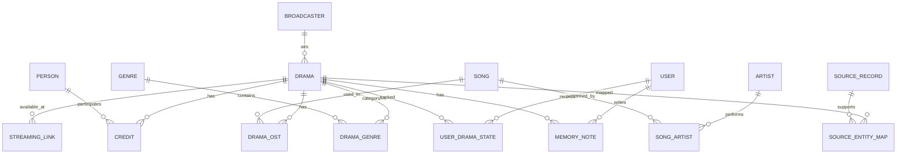

# Data Model

## 1. 원칙

1. canonical entity와 source record를 분리한다.
2. 외부 문자열을 곧바로 canonical ID로 취급하지 않는다.
3. 모든 자동 병합에는 confidence/provenance가 남아야 한다.
4. 검색용 문서는 canonical model의 derived projection이다.
5. Neo4j는 PostgreSQL을 대체하지 않는다.
6. 사용자 콘텐츠와 공개 카탈로그 데이터를 분리한다.

---

## 2. Core ERD



---

## 3. Canonical Tables

### `broadcaster`

```sql
CREATE TABLE broadcaster (
  id              BIGSERIAL PRIMARY KEY,
  code            VARCHAR(32) UNIQUE NOT NULL,
  name_ko         VARCHAR(100) NOT NULL,
  name_en         VARCHAR(100),
  official_url    TEXT,
  created_at      TIMESTAMPTZ NOT NULL DEFAULT now(),
  updated_at      TIMESTAMPTZ NOT NULL DEFAULT now()
);
```

### `drama`

```sql
CREATE TABLE drama (
  id                BIGSERIAL PRIMARY KEY,
  slug              VARCHAR(180) UNIQUE NOT NULL,
  title_ko          VARCHAR(255) NOT NULL,
  title_en          VARCHAR(255),
  title_normalized  VARCHAR(255) NOT NULL,
  broadcaster_id    BIGINT REFERENCES broadcaster(id),
  start_date        DATE,
  end_date          DATE,
  episode_count     INTEGER,
  runtime_minutes   INTEGER,
  synopsis          TEXT,
  official_page_url TEXT,
  status            VARCHAR(30) NOT NULL DEFAULT 'PUBLISHED',
  canonical_version BIGINT NOT NULL DEFAULT 1,
  created_at        TIMESTAMPTZ NOT NULL DEFAULT now(),
  updated_at        TIMESTAMPTZ NOT NULL DEFAULT now()
);

CREATE INDEX idx_drama_start_date ON drama(start_date);
CREATE INDEX idx_drama_broadcaster ON drama(broadcaster_id);
CREATE INDEX idx_drama_title_normalized ON drama(title_normalized);
```

### `drama_alias`

```sql
CREATE TABLE drama_alias (
  drama_id        BIGINT NOT NULL REFERENCES drama(id),
  alias           VARCHAR(255) NOT NULL,
  alias_normalized VARCHAR(255) NOT NULL,
  language_code   VARCHAR(16),
  alias_type      VARCHAR(30),
  PRIMARY KEY (drama_id, alias_normalized)
);
```

### `person`

```sql
CREATE TABLE person (
  id                BIGSERIAL PRIMARY KEY,
  slug              VARCHAR(180) UNIQUE NOT NULL,
  name_ko           VARCHAR(150) NOT NULL,
  name_en           VARCHAR(150),
  name_normalized   VARCHAR(150) NOT NULL,
  birth_date        DATE,
  canonical_version BIGINT NOT NULL DEFAULT 1,
  created_at        TIMESTAMPTZ NOT NULL DEFAULT now(),
  updated_at        TIMESTAMPTZ NOT NULL DEFAULT now()
);
```

### `credit`

```sql
CREATE TABLE credit (
  id             BIGSERIAL PRIMARY KEY,
  drama_id       BIGINT NOT NULL REFERENCES drama(id),
  person_id      BIGINT NOT NULL REFERENCES person(id),
  credit_type    VARCHAR(30) NOT NULL,
  character_name VARCHAR(150),
  billing_order  INTEGER,
  is_main_cast   BOOLEAN NOT NULL DEFAULT false,
  UNIQUE (drama_id, person_id, credit_type, character_name)
);

CREATE INDEX idx_credit_person ON credit(person_id, drama_id);
CREATE INDEX idx_credit_drama ON credit(drama_id, billing_order);
```

`credit_type` 예:

```text
ACTOR
DIRECTOR
WRITER
PRODUCER
```

---

## 4. OST Model

### `song`

```sql
CREATE TABLE song (
  id              BIGSERIAL PRIMARY KEY,
  title           VARCHAR(255) NOT NULL,
  title_normalized VARCHAR(255) NOT NULL,
  release_date    DATE,
  duration_seconds INTEGER,
  created_at      TIMESTAMPTZ NOT NULL DEFAULT now(),
  updated_at      TIMESTAMPTZ NOT NULL DEFAULT now()
);
```

### `artist`

```sql
CREATE TABLE artist (
  id              BIGSERIAL PRIMARY KEY,
  name            VARCHAR(180) NOT NULL,
  name_normalized VARCHAR(180) NOT NULL,
  UNIQUE(name_normalized)
);
```

### `song_artist`

```sql
CREATE TABLE song_artist (
  song_id    BIGINT NOT NULL REFERENCES song(id),
  artist_id  BIGINT NOT NULL REFERENCES artist(id),
  role       VARCHAR(30) NOT NULL DEFAULT 'PERFORMER',
  sort_order INTEGER,
  PRIMARY KEY(song_id, artist_id, role)
);
```

### `drama_ost`

```sql
CREATE TABLE drama_ost (
  drama_id   BIGINT NOT NULL REFERENCES drama(id),
  song_id    BIGINT NOT NULL REFERENCES song(id),
  part_no    INTEGER,
  track_no   INTEGER,
  PRIMARY KEY(drama_id, song_id)
);
```

---

## 5. Genre / Tags

정형 장르는 canonical taxonomy로 관리한다.

```sql
CREATE TABLE genre (
  id BIGSERIAL PRIMARY KEY,
  code VARCHAR(50) UNIQUE NOT NULL,
  name_ko VARCHAR(100) NOT NULL
);

CREATE TABLE drama_genre (
  drama_id BIGINT NOT NULL REFERENCES drama(id),
  genre_id BIGINT NOT NULL REFERENCES genre(id),
  PRIMARY KEY(drama_id, genre_id)
);
```

비정형 테마는 `keyword` 또는 GraphRAG-derived concept로 분리한다.

---

## 6. Official Links

```sql
CREATE TABLE streaming_link (
  id                 BIGSERIAL PRIMARY KEY,
  drama_id           BIGINT NOT NULL REFERENCES drama(id),
  provider_code      VARCHAR(60) NOT NULL,
  url                TEXT NOT NULL,
  link_type          VARCHAR(30) NOT NULL,
  region_code        VARCHAR(10) DEFAULT 'KR',
  availability_status VARCHAR(30) NOT NULL DEFAULT 'UNKNOWN',
  http_status        INTEGER,
  last_verified_at   TIMESTAMPTZ,
  valid_from         TIMESTAMPTZ,
  valid_to           TIMESTAMPTZ,
  source_record_id   BIGINT,
  UNIQUE(drama_id, provider_code, url)
);
```

`link_type`:

```text
OFFICIAL_VOD
BROADCASTER_PAGE
OTT_DETAIL
OFFICIAL_CLIP
OFFICIAL_OST
```

---

## 7. User Model

인증 방식은 [ADR-011 Guest-first Authentication](ADR/ADR-011-guest-first-auth.md)을 따른다. 익명 사용자와 로그인 사용자는 같은 `app_user` 행이며, `user_identity` 유무로 구분한다.

### `app_user`

```sql
CREATE TABLE app_user (
  id              UUID PRIMARY KEY,
  display_name    VARCHAR(80),
  anonymous       BOOLEAN NOT NULL DEFAULT true,
  status          VARCHAR(20) NOT NULL DEFAULT 'ACTIVE',   -- ACTIVE / MERGED / DELETED
  merged_into_id  UUID REFERENCES app_user(id),
  last_active_at  TIMESTAMPTZ NOT NULL DEFAULT now(),
  upgraded_at     TIMESTAMPTZ,                              -- 익명 → 로그인 승격 시각
  created_at      TIMESTAMPTZ NOT NULL DEFAULT now(),
  updated_at      TIMESTAMPTZ NOT NULL DEFAULT now()
);
```

`anonymous = true`이고 `last_active_at`이 90일 이전이면 `anonymous_user_cleanup` DAG가 삭제한다.

### `user_identity`

소셜 provider 연결. 이메일·프로필 이미지는 저장하지 않는다.

```sql
CREATE TABLE user_identity (
  user_id           UUID NOT NULL REFERENCES app_user(id) ON DELETE CASCADE,
  provider          VARCHAR(30) NOT NULL,      -- 'kakao', 'naver', 'google', 'email'
  provider_subject  VARCHAR(255) NOT NULL,     -- provider가 발급한 고유 ID
  email             VARCHAR(255),              -- 선택 동의 시에만
  linked_at         TIMESTAMPTZ NOT NULL DEFAULT now(),
  PRIMARY KEY (provider, provider_subject),
  UNIQUE (user_id, provider)
);
```

### `user_consent`

동의 시각과 약관 버전을 남긴다.

```sql
CREATE TABLE user_consent (
  user_id       UUID NOT NULL REFERENCES app_user(id) ON DELETE CASCADE,
  consent_type  VARCHAR(40) NOT NULL,    -- 'TERMS', 'PRIVACY', 'AGE_14_PLUS', 'MARKETING'
  version       VARCHAR(20) NOT NULL,    -- 약관 문서 버전
  granted       BOOLEAN NOT NULL,
  recorded_at   TIMESTAMPTZ NOT NULL DEFAULT now(),
  PRIMARY KEY (user_id, consent_type, version)
);
```

`TERMS`, `PRIVACY`, `AGE_14_PLUS`는 소셜 연결 시 필수. `MARKETING`은 선택이며 거부해도 이용 가능하다.

### `user_drama_state`

```sql
CREATE TABLE user_drama_state (
  user_id     UUID NOT NULL REFERENCES app_user(id),
  drama_id    BIGINT NOT NULL REFERENCES drama(id),
  status      VARCHAR(30) NOT NULL,
  rating      NUMERIC(2,1),
  first_watched_year SMALLINT,
  created_at  TIMESTAMPTZ NOT NULL DEFAULT now(),
  updated_at  TIMESTAMPTZ NOT NULL DEFAULT now(),
  PRIMARY KEY(user_id, drama_id)
);
```

### `memory_note`

```sql
CREATE TABLE memory_note (
  id          UUID PRIMARY KEY,
  user_id     UUID NOT NULL REFERENCES app_user(id),
  drama_id    BIGINT NOT NULL REFERENCES drama(id),
  body        TEXT NOT NULL,
  visibility  VARCHAR(20) NOT NULL DEFAULT 'PRIVATE',
  moderation_status VARCHAR(30) NOT NULL DEFAULT 'PENDING',
  created_at  TIMESTAMPTZ NOT NULL DEFAULT now(),
  updated_at  TIMESTAMPTZ NOT NULL DEFAULT now()
);
```

---

## 8. Provenance Model

### `source`

```sql
CREATE TABLE source (
  id             BIGSERIAL PRIMARY KEY,
  code           VARCHAR(60) UNIQUE NOT NULL,
  base_url       TEXT,
  source_type    VARCHAR(30) NOT NULL,
  trust_level    SMALLINT NOT NULL,
  terms_note     TEXT,
  active         BOOLEAN NOT NULL DEFAULT true
);
```

### `source_record`

```sql
CREATE TABLE source_record (
  id             BIGSERIAL PRIMARY KEY,
  source_id      BIGINT NOT NULL REFERENCES source(id),
  external_id    VARCHAR(255),
  entity_type    VARCHAR(30) NOT NULL,
  source_url     TEXT NOT NULL,
  object_key     TEXT,
  content_hash   VARCHAR(128),
  fetched_at     TIMESTAMPTZ NOT NULL,
  parser_version VARCHAR(80),
  raw_metadata   JSONB,
  UNIQUE(source_id, entity_type, external_id, content_hash)
);
```

### `source_entity_map`

```sql
CREATE TABLE source_entity_map (
  id              BIGSERIAL PRIMARY KEY,
  source_record_id BIGINT NOT NULL REFERENCES source_record(id),
  canonical_type  VARCHAR(30) NOT NULL,
  canonical_id    BIGINT NOT NULL,
  match_method    VARCHAR(50) NOT NULL,
  confidence      NUMERIC(5,4),
  reviewed_by     UUID,
  reviewed_at     TIMESTAMPTZ,
  created_at      TIMESTAMPTZ NOT NULL DEFAULT now()
);
```

---

### `staging_record` (Silver)

raw `source_record` 하나당 정규화된 payload 하나. canonical ID는 아직 없다.

```sql
CREATE TABLE staging_record (
  id                BIGSERIAL PRIMARY KEY,
  source_record_id  BIGINT NOT NULL UNIQUE REFERENCES source_record(id),
  entity_type       VARCHAR(30) NOT NULL,
  parser_version    VARCHAR(80) NOT NULL,
  payload           JSONB,            -- NormalizedDrama (data-platform normalization/models.py)
  status            VARCHAR(30) NOT NULL DEFAULT 'NEW',
  resolution        JSONB,            -- entity resolution 결과 (엔티티별 decision/canonical_id/signals)
  issues            JSONB,            -- parse 오류 / quality 이슈
  created_at        TIMESTAMPTZ NOT NULL DEFAULT now(),
  updated_at        TIMESTAMPTZ NOT NULL DEFAULT now()
);
```

상태 흐름:

```text
NEW → RESOLVED → PUBLISHED
    ↘ REVIEW   (admin review queue)
    ↘ REJECTED (quality gate ERROR)
PARSE_FAILED (dead-letter; parser_version 변경 시 재파싱)
```

`source_entity_map.external_ref`는 drama 레코드 안에 중첩된 person/song의 source 내부 ID를 기억해 재수집 시 결정적으로 매칭한다.

---

## 9. Entity Resolution

### Candidate key

```text
Person:
  normalized_name
  + birth_date
  + known_work_overlap
  + external_identifier

Drama:
  normalized_title
  + broadcaster
  + start_year
  + episode_count
```

### Match result

```json
{
  "candidate_id": 123,
  "score": 0.97,
  "signals": {
    "name": 1.0,
    "birth_date": 1.0,
    "work_overlap": 0.88
  },
  "decision": "AUTO_MERGE"
}
```

threshold 예:

```text
>= 0.97 AUTO_MERGE
0.80 ~ 0.97 REVIEW
< 0.80 CREATE_NEW / REVIEW
```

숫자는 초기 가설이며 실제 validation set으로 튜닝한다.

---

## 10. Search Projection

> **구현 메모 (V10)**: 실제 마이그레이션은 `(entity_type, entity_id)`를 UNIQUE로 두고 `document_version`을 갱신 시 증가시킨다(같은 엔티티의 여러 버전을 보관하지 않음). `aliases` 컬럼을 분리해 title/alias는 weight A, body는 weight B로 FTS에 넣고, 한국어 부분 일치는 `pg_trgm`(`word_similarity`)으로 보완한다. FTS와 trigram 결과는 **RRF(k=60)** 로 결합한다. `embedding` 컬럼은 임베딩 모델(차원) 확정 후 DM-601 마이그레이션에서 추가한다. 질의 로그는 `search_query_log`(사용자 식별자 없음, zero-result 인덱스).

`search_document`

```sql
CREATE EXTENSION IF NOT EXISTS vector;

CREATE TABLE search_document (
  id                 BIGSERIAL PRIMARY KEY,
  entity_type        VARCHAR(30) NOT NULL,
  entity_id          BIGINT NOT NULL,
  title              TEXT NOT NULL,
  body               TEXT NOT NULL,
  metadata           JSONB NOT NULL,
  document_version   BIGINT NOT NULL,
  embedding_model    VARCHAR(100),
  embedding          VECTOR(1536),
  embedding_updated_at TIMESTAMPTZ,
  updated_at         TIMESTAMPTZ NOT NULL DEFAULT now(),
  UNIQUE(entity_type, entity_id, document_version)
);
```

실제 dimension은 선택한 embedding model에 맞춰 migration으로 고정한다.

FTS:

```sql
ALTER TABLE search_document
ADD COLUMN fts tsvector
GENERATED ALWAYS AS (
  to_tsvector('simple', coalesce(title,'') || ' ' || coalesce(body,''))
) STORED;

CREATE INDEX idx_search_fts
ON search_document USING GIN(fts);
```

HNSW:

```sql
CREATE INDEX idx_search_embedding_hnsw
ON search_document
USING hnsw (embedding vector_cosine_ops);
```

---

## 11. Outbox

```sql
CREATE TABLE outbox_event (
  id            UUID PRIMARY KEY,
  aggregate_type VARCHAR(50) NOT NULL,
  aggregate_id   VARCHAR(100) NOT NULL,
  event_type     VARCHAR(100) NOT NULL,
  payload        JSONB NOT NULL,
  created_at     TIMESTAMPTZ NOT NULL DEFAULT now(),
  published_at   TIMESTAMPTZ
);
```

예:

```text
USER_DRAMA_STATE_UPDATED
DRAMA_CANONICAL_UPDATED
MEMORY_NOTE_PUBLISHED
```

---

## 12. Versioning

변경 가능한 derived data에는 아래 버전 중 필요한 값을 저장한다.

```text
canonical_version
parser_version
search_document_version
embedding_model
embedding_version
graph_projection_version
graphrag_index_version
```

“현재 검색 결과가 왜 달라졌는가?”를 재현할 수 있어야 한다.

---

## 13. Soft Delete

외부 source에서 사라졌다고 canonical record를 바로 삭제하지 않는다.

상태:

```text
PUBLISHED
HIDDEN
DEPRECATED
MERGED
```

`MERGED` entity에는 redirect 대상 canonical ID를 저장한다.

---

## 14. PII

공개 카탈로그와 user data를 논리적으로 분리한다.

- user UUID를 검색 corpus에 직접 넣지 않는다.
- private memory note는 public GraphRAG corpus에 포함하지 않는다.
- telemetry에서 user note 원문을 수집하지 않는다.

---

## 15. Derived Analytics

초기에는 materialized view 또는 batch aggregate:

```text
year_drama_count
broadcaster_year_count
actor_drama_count
user_year_watch_count
user_actor_watch_count
```

데이터 규모가 커진 뒤 별도 OLAP warehouse를 검토한다.
