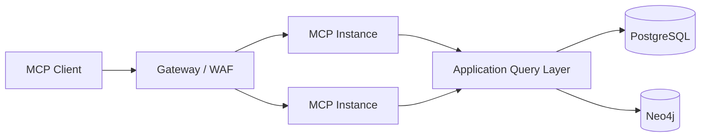

# DramaMemory MCP Specification

## 1. 목적

DramaMemory의 catalog/search/timeline 기능을 AI Client가 표준 도구처럼 사용할 수 있게 한다.

MCP는 내부 REST API를 대체하지 않는다.

```text
Web → REST APIs
AI Clients → MCP
               ↓
        Application Query Layer
```

작성 기준: MCP `2026-07-28`.

해당 버전은 stateless protocol core를 도입했으며, 서버가 세션 affinity 없이 일반적인 HTTP infrastructure 뒤에서 scale-out되기 쉬운 구조를 제공한다.

## 구현 현황 (2026-09-28, `apps/mcp-server`)

| 설계 항목 | 구현 |
|---|---|
| §2 Transport | Python SDK v2 `MCPServer`, `POST /mcp` streamable HTTP **stateless + JSON 응답** — 세션 저장소 없음, 인스턴스 어디서나 응답. `/health` 별도 |
| §4 Public tools | `search_dramas`(ai-api hybrid, `year_from/year_to/broadcaster`는 질의 해석보다 우선), `get_drama`, `get_actor`(그래프 공동출연 요약 포함, 그래프 장애 시 빈 목록), `get_ost`, `get_official_watch_links`(`last_verified_at` 포함, 전부 미검증이면 `LINK_STALE` 경고), `traverse_drama_graph`(ACTED_IN/HAS_OST/PERFORMED, depth ≤ 2, 50노드 cap, Cypher 미노출) |
| §5 Protected tools | **미등록** — OAuth 인가 서버가 없어 무방비 노출 대신 등록하지 않음 |
| §6 Resources | `drama://{id}`, `actor://{id}`, `year://{year}`, `broadcaster://{code}` (`timeline://me`는 §5와 같은 이유로 없음) |
| §7 Prompts | `nostalgia_search`, `actor_journey` |
| §9 Rate limit | 프로세스 내 1분 슬라이딩 윈도(IP당 search 30 / read 120 / graph 20) — scale-out 시 게이트웨이로 이관 |
| §10/§14 Safety | 읽기 전용, 임의 URL·SQL·Cypher 없음, 서버 고정 URL만 호출, `user_id` 인자 없음 |
| §11 Error model | 도구 결과로 `{"error": {code, message, retryable}}` (`DRAMA_NOT_FOUND`, `PERSON_NOT_FOUND`, `UPSTREAM_UNAVAILABLE`, `RATE_LIMITED`, `EMPTY_QUERY`) |
| §12 Observability | 미구현 (OpenTelemetry는 Phase 6에서 세 서비스 함께) |

지원 변경: domain-api `GET /api/v1/dramas/by-id/{id}`, `/persons/by-id/{id}`(MERGED는 slug와 같이 301), ai-api `/v1/search?year_from&year_to&broadcaster`.

---

# 2. Transport / Deployment

Remote MCP server:

```text
POST /mcp
```

Architecture:



MCP protocol state를 shared session store에 의존하지 않는다.

---

# 3. Capabilities

DramaMemory는 우선 세 범주를 제공한다.

- Tools
- Resources
- Prompts

MCP extension은 제품 필요가 생겼을 때 추가한다.

---

# 4. Public Tools

## `search_dramas`

설명:

자연어/필터로 드라마 후보를 검색한다.

Input:

```json
{
  "query": "2016년 겨울 공유 드라마",
  "year_from": 2015,
  "year_to": 2017,
  "broadcaster": null,
  "limit": 10
}
```

Output:

```json
{
  "items": [
    {
      "drama_id": 123,
      "title": "도깨비",
      "year": 2016,
      "match_reasons": ["actor:공유", "year:2016"]
    }
  ]
}
```

Tool 내부에서 필요에 따라 Hybrid Retrieval을 수행한다.

---

## `get_drama`

Input:

```json
{"drama_id": 123}
```

Output:

- title
- dates
- broadcaster
- genres
- cast
- OST
- official link state
- provenance summary

---

## `get_actor`

Input:

```json
{"person_id": 456}
```

Output:

- canonical profile
- works
- collaboration summary

---

## `get_ost`

Input:

```json
{"drama_id": 123}
```

---

## `get_official_watch_links`

Input:

```json
{"drama_id": 123, "region": "KR"}
```

Output에는 `last_verified_at`을 포함한다.

LLM이 URL을 생성하지 않고 저장된 검증 링크를 반환한다.

---

## `traverse_drama_graph`

Input:

```json
{
  "start": {"type": "DRAMA", "id": 123},
  "relations": ["ACTED_IN", "HAS_OST", "PERFORMED"],
  "max_depth": 2,
  "limit": 50
}
```

보안상 arbitrary Cypher는 받지 않는다.

---

# 5. Protected Tools

OAuth authorization 필요.

## `get_my_timeline`

```json
{}
```

## `mark_watched`

```json
{
  "drama_id": 123,
  "status": "WATCHED"
}
```

write tool은 다음을 만족해야 한다.

- authenticated user
- explicit tool description
- idempotency
- audit log
- 필요 시 client/user confirmation UX

## `add_memory_note`

```json
{
  "drama_id": 123,
  "body": "수능 끝나고 가족이랑 봤다.",
  "visibility": "PRIVATE"
}
```

---

# 6. Resources

## `drama://{drama_id}`

canonical drama representation.

## `actor://{person_id}`

## `year://{year}`

해당 연도의 summary/list.

## `broadcaster://{code}`

## `timeline://me`

authorization required.

### Resource caching

MCP 2026-07-28의 cache hint/list caching 성격을 활용할 수 있도록 public stable resource는 TTL을 부여한다.

개인 resource는 public cache를 금지한다.

---

# 7. Prompts

Prompt는 convenience capability일 뿐 핵심 business logic이 아니다.

## `nostalgia_search`

목적:

모호한 기억을 검색 query로 정리.

Arguments:

```text
memory_text
optional_year_hint
```

## `actor_journey`

배우 출연작을 시대순으로 정리.

## `timeline_recap`

사용자 개인 기록을 기반으로 연대기 요약.

private data authorization 필요.

---

# 8. Authorization

Public:

```text
search_dramas
get_drama
get_actor
get_ost
```

Protected:

```text
timeline://me
get_my_timeline
mark_watched
add_memory_note
```

MCP 2026-07-28 authorization hardening을 따라 issuer validation 등 OAuth/OIDC 보안 요구를 적용한다.

token scope 예:

```text
catalog:read
timeline:read
timeline:write
memory:write
```

---

# 9. Rate Limit

예:

```text
anonymous search: 30 req/min/IP
authenticated read: 120 req/min/user
graph traversal: 20 req/min/user
write: lower + abuse detection
```

실제 값은 traffic 측정 후 결정.

---

# 10. Tool Safety

MCP client가 모델에게 tool을 노출한다고 해서 모델이 무제한 작업 권한을 가져서는 안 된다.

원칙:

- 최소 권한
- read/write scope 분리
- destructive tool 없음
- arbitrary URL fetch tool 없음
- arbitrary SQL/Cypher tool 없음
- user-specific operation은 OAuth
- audit log

---

# 11. Tool Error Model

예:

```json
{
  "code": "DRAMA_NOT_FOUND",
  "message": "No canonical drama exists for id=123",
  "retryable": false
}
```

```json
{
  "code": "LINK_STALE",
  "message": "Official link exists but has not been verified recently.",
  "retryable": true
}
```

---

# 12. Observability

span:

```text
mcp.request
 ├─ mcp.auth
 ├─ tool.search_dramas
 │   ├─ retrieval.sql
 │   └─ retrieval.vector
 └─ serialize
```

attribute:

```text
mcp.method
mcp.name
client.name
tool.result_count
auth.scope
```

사용자 note 내용은 span에 남기지 않는다.

---

# 13. Versioning

tool schema는 안정적으로 유지한다.

breaking change:

```text
search_dramas_v2
```

보다 MCP capability/version negotiation과 server semantic versioning을 우선 사용하되, 실제 client compatibility를 깨는 변경은 migration 기간을 둔다.

---

# 14. Threat Model

### Prompt injection through stored content

stored text가 tool call authority를 바꾸지 못하게 한다.

### SSRF

MCP tool에서 임의 URL을 받아 fetch하지 않는다.

### Graph explosion

depth/node cap.

### Account confused deputy

token subject와 requested user identity를 client input으로 분리하지 않는다.

`user_id`를 protected tool argument로 받지 않고 auth subject에서 결정한다.

---

# 15. Why MCP Is Justified

MCP를 쓰는 근거:

1. 동일한 catalog/search capability를 여러 AI client가 재사용
2. tool schema를 명시
3. 인증된 개인 timeline까지 agent에 연결
4. 웹 UI 외에 AI-native distribution channel 확보

MCP가 필요 없는 경우:

- 웹에서만 사용할 때
- REST client가 하나뿐일 때
- agent interoperability가 제품 방향과 무관할 때

따라서 MVP 핵심 catalog 완성 뒤 도입한다.

---

# 16. References

- MCP 2026-07-28 Specification release  
  https://blog.modelcontextprotocol.io/posts/2026-07-28/
- TypeScript SDK v2  
  https://ts.sdk.modelcontextprotocol.io/v2/
