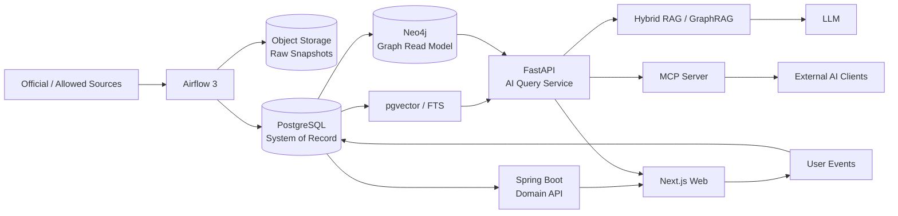

# DramaMemory — Product Requirements Document (PRD)

> **Working title:** DramaMemory  
> **Version:** v0.1  
> **Date:** 2026-09-26  
> **Concept:** 한국 드라마를 방송사·연도·배우·OST·관계로 탐색하고, 사용자가 자신이 봤던 작품을 기록하며 추억을 다시 발견하는 **드라마 메모리 아카이브 + AI 탐색 서비스**

---

## 0. Executive Summary

DramaMemory는 KBS, MBC, SBS, JTBC, tvN 등 국내 방송사의 드라마 정보를 한곳에 정리하고, 사용자가 **“내가 봤던 드라마를 다시 떠올리는 경험”**을 제공하는 서비스다.

각 작품은 방송사, 방영 기간, 출연진, OST, 장르, 공식 다시보기 링크 등의 정보를 가지며, 사용자는 작품을 `봤어요`로 기록하고 자신의 **드라마 연대기**를 만들 수 있다.

서비스의 차별점은 단순 콘텐츠 DB가 아니다.

1. **연도·배우·OST·방송사·관계 기반 탐색**
2. **내가 본 드라마를 기록하는 개인 연대기**
3. **정확한 제목을 몰라도 찾을 수 있는 자연어 추억 검색**
4. **작품·배우·OST의 관계를 활용한 GraphRAG 탐색**
5. **수집·정제·링크 검증·임베딩·그래프 갱신을 Airflow로 자동화**
6. **동일한 데이터/검색 능력을 MCP Server로 외부 AI Agent에 제공**
7. 검색 유입과 재방문을 바탕으로 광고 및 공식 VOD/제휴 링크 수익화

핵심 원칙은 **“최신 기술을 쓰기 위해 기능을 만들지 않는다.”**  
모든 기술은 아래의 실제 문제 중 하나를 해결해야 한다.

- 데이터가 여러 출처에 흩어져 지속적으로 변경된다.
- 제목을 기억하지 못하는 사용자의 모호한 검색 의도가 존재한다.
- 드라마 도메인은 배우↔작품↔OST↔방송사 관계가 강하다.
- AI 답변은 공식 링크와 근거 데이터로 추적 가능해야 한다.
- 서비스 데이터가 향후 ChatGPT/Claude/Cursor 등 Agent 생태계에서도 재사용될 수 있어야 한다.

---

# 1. Problem

현재 사용자가 과거 드라마를 다시 떠올리는 과정은 여러 사이트에 분산되어 있다.

- “2016년에 tvN에서 했던 드라마 뭐였지?”
- “공유랑 이동욱 같이 나온 작품 뭐였지?”
- “여주가 호텔 사장이었는데 OST가 유명했던 드라마”
- “고등학생 때 봤던 KBS 드라마들을 한번 보고 싶다.”
- “도깨비 다시 보려면 지금 어디로 가야 하지?”
- “내가 지금까지 본 드라마가 몇 편이지?”

검색엔진, 방송사 홈페이지, OTT, 위키, YouTube/Melon 등에 정보가 각각 존재하지만 **개인의 기억을 중심으로 연결된 탐색 경험**은 부족하다.

DramaMemory는 이 문제를 다음 구조로 해결한다.

> **기억 → 탐색 → 발견 → 기록 → 다시보기**

---

# 2. Product Vision

## 2.1 Vision Statement

> “내 인생에서 봤던 드라마를 시간과 사람, 음악으로 다시 만나는 곳.”

## 2.2 Product Positioning

DramaMemory는 다음 서비스가 아니다.

- 불법 스트리밍 사이트
- OTT 영상 호스팅 서비스
- 단순 방송 편성표
- 위키 복제 사이트
- 드라마 줄거리 자동 생성 사이트

DramaMemory는 **드라마 관계 데이터와 개인 시청 기록을 기반으로 한 추억 탐색 서비스**다.

---

# 3. Goals / Non-Goals

## 3.1 Goals

### G1. 과거 드라마 탐색
연도, 방송사, 배우, OST, 장르 등의 축으로 드라마를 발견할 수 있어야 한다.

### G2. 기억 기반 자연어 검색
정확한 제목을 몰라도 다음과 같은 질문으로 작품을 찾을 수 있어야 한다.

- “2010년대 초반 SBS에서 했던 의학 드라마”
- “겨울 느낌 나고 공유 나왔던 드라마”
- “호텔 배경에 아이유 나온 드라마”
- “응답하라 시리즈랑 비슷한 시기에 본 가족 드라마”

### G3. 개인 드라마 연대기
사용자가 본 작품을 기록하고 연도별 시청 기록을 시각화한다.

### G4. 공식 다시보기 연결
영상은 직접 호스팅하지 않고 방송사/OTT 등 **공식 경로**로 연결한다.

### G5. 자동화된 콘텐츠 데이터 플랫폼
수집 → 정제 → 엔티티 매칭 → 품질 검증 → 검색 인덱스 → 그래프 → 임베딩 갱신이 재현 가능한 파이프라인으로 동작한다.

### G6. AI-native 데이터 인터페이스
웹 서비스뿐 아니라 MCP를 통해 AI Agent도 DramaMemory의 검색/그래프/사용자 기록 도구를 사용할 수 있게 한다.

---

## 3.2 Non-Goals

MVP에서는 다음을 하지 않는다.

- 영상 직접 스트리밍
- OST 음원 직접 재생/호스팅
- 무단 방송 캡처/포스터 저장
- 범용 영화/예능 DB
- 자체 LLM 학습
- 실시간 방송 편성 서비스
- 추천 정확도를 위한 과도한 마이크로서비스 분리
- Kubernetes를 사용하기 위한 Kubernetes 도입
- Kafka를 사용하기 위한 Kafka 도입

---

# 4. Target Users

## Persona A — 추억 탐색형

> “예전에 봤던 드라마인데 제목이 기억 안 난다.”

주요 행동:
- 연도/배우/방송사로 탐색
- 자연어 검색
- OST를 보고 작품을 떠올림

## Persona B — 드라마 기록형

> “내가 지금까지 본 드라마들을 정리하고 싶다.”

주요 행동:
- 봤어요 체크
- 별점/한줄 기억 기록
- 드라마 연대기 공유

## Persona C — 팬 탐색형

> “이 배우 출연작을 시대순으로 보고 싶다.”

주요 행동:
- 배우 페이지
- 작품 관계 그래프
- 출연진/OST 연결 탐색

---

# 5. Core User Journey

## Journey 1 — 연도에서 추억하기

`홈 → 2016년 → tvN → 도깨비 → OST 확인 → 공식 다시보기`

## Journey 2 — 기억만으로 찾기

사용자:

> “2016년쯤 겨울 느낌이고 공유가 나온 드라마인데 OST도 유명했어.”

시스템:

1. Query Router가 의도를 분석
2. 구조화 조건 `배우=공유`, `연도≈2016` 추출
3. Vector/Full-text 검색으로 “겨울”, “OST 유명” 의미 검색
4. Knowledge Graph에서 배우-드라마-OST 관계 확장
5. 후보 재정렬
6. 근거와 함께 `도깨비` 제시
7. 공식 다시보기 링크 제공

## Journey 3 — 내 드라마 연대기

`로그인 → 작품 봤어요 체크 → /my/timeline`

예시:

```text
2009  선덕여왕
2010  시크릿 가든
2012  해를 품은 달
2013  별에서 온 그대
2015  응답하라 1988
2016  도깨비 / 태양의 후예
2018  나의 아저씨
2020  슬기로운 의사생활
```

추가 통계:

- 총 본 작품 수
- 연도별 시청 편수
- 가장 많이 본 방송사
- 가장 많이 본 배우
- 가장 많이 본 장르
- 총 예상 시청 시간

---

# 6. Functional Requirements

## FR-01. Drama Catalog

작품 필드:

- title
- aliases
- broadcaster
- channel
- start_date
- end_date
- episode_count
- genres
- synopsis
- official_page_url
- status

필터:

- 연도
- 방송사
- 장르
- 배우
- 요일
- OTT/공식 다시보기 가능 여부

---

## FR-02. Drama Detail

작품 상세 화면에서 제공:

- 기본 정보
- 방영 기간
- 방송사
- 출연진
- OST
- 장르
- 관련 작품
- 공식 다시보기 링크
- 사용자의 시청 여부
- 사용자의 한줄 기억
- AI에게 이 작품 물어보기

---

## FR-03. Actor / Person

배우 상세:

- 출연작 타임라인
- 역할명
- 공동 출연 배우
- 사용자가 본 출연작 수
- 관계 그래프

예:

```text
공유
 ├─ 커피프린스 1호점
 ├─ 빅
 ├─ 도깨비
 └─ 트렁크
```

---

## FR-04. OST

OST 페이지:

- 곡명
- 가수
- 작품
- 발매일
- 공식 음원/영상 링크

서비스는 음원을 직접 저장하지 않는다.

---

## FR-05. Official Watch Links

`StreamingLink`

- drama_id
- provider
- url
- link_type
- last_verified_at
- availability_status
- region

Airflow가 주기적으로 링크 상태를 확인한다.

---

## FR-06. Watched

사용자는 작품을 다음 상태로 저장할 수 있다.

- WATCHED
- WATCHING
- WANT_TO_WATCH

MVP에서 별점은 선택 기능으로 둔다.

---

## FR-07. Memory Note

작품별 한줄 추억:

> “고3 수능 끝나고 가족이랑 같이 봤다.”

사용자 작성 텍스트는 공개/비공개를 선택한다.

공개 콘텐츠는 신고/블라인드/관리자 모더레이션 기능을 가진다.

---

## FR-08. Timeline

`/my/timeline`

- 연도순 시청작
- 방송사 비율
- 장르 비율
- 배우 통계
- 시청량
- 공유 카드 생성

---

# 7. AI Search Requirements

## 7.1 검색 유형

모든 질문을 LLM 하나에 던지지 않는다.

Query Router가 다음 중 하나 또는 복합 전략을 선택한다.

### A. Structured Search

정확한 조건 검색.

예:

> “2016년 tvN 드라마”

→ PostgreSQL

---

### B. Full-text Search

제목/배우/OST명 등 lexical match가 중요한 검색.

예:

> “태양 후예”

→ PostgreSQL FTS 또는 추후 OpenSearch

---

### C. Vector Search

기억이 모호하거나 분위기/의미 중심 검색.

예:

> “겨울 분위기 나는 쓸쓸한 판타지 로맨스”

→ pgvector

---

### D. Graph Search

다중 관계 질의.

예:

> “공유와 이동욱이 같이 나온 작품 OST 중 여자 가수가 부른 노래”

→ Neo4j/Cypher

---

### E. GraphRAG

관계 + 의미적 설명을 함께 요구하는 질의.

예:

> “응답하라 1988과 비슷한 시기 작품 중 가족 관계가 중요한 드라마를 연결해서 설명해줘.”

→ Graph neighborhood + community/context + Vector retrieval

---

# 8. RAG Architecture

## 8.1 Why RAG?

LLM 자체 기억에 의존하면 다음 문제가 있다.

- 드라마 정보 누락
- 방송 기간/OST/배우 hallucination
- 현재 다시보기 링크 오류
- 최신 OTT 상태 반영 불가

따라서 LLM은 **답을 알고 있는 저장소가 아니라 검색 결과를 설명하는 계층**으로 사용한다.

---

## 8.2 Retrieval Pipeline

```text
User Query
    ↓
Query Understanding
    ↓
Metadata Extraction
    ↓
Retrieval Router
    ├─ SQL
    ├─ Full Text
    ├─ Vector
    └─ Graph
          ↓
Candidate Fusion
          ↓
Reranker
          ↓
Context Builder
          ↓
LLM
          ↓
Grounded Answer + Sources + Official Links
```

---

# 9. Why GraphRAG?

드라마 데이터는 본질적으로 관계형이다.

```text
Actor ─ACTED_IN→ Drama
Drama ─AIRED_BY→ Broadcaster
Drama ─HAS_OST→ Song
Artist ─PERFORMED→ Song
Drama ─HAS_GENRE→ Genre
Drama ─AVAILABLE_ON→ Platform
Drama ─AIRED_IN→ Year
```

일반 Vector RAG는 “비슷한 문서 찾기”에는 강하지만, 다단계 관계를 정확하게 따라가는 질문에서는 불필요한 문서 검색과 hallucination이 발생할 수 있다.

GraphRAG는 다음 질문에 직접적인 가치가 있다.

- 같은 배우가 출연한 작품 연결
- 특정 기간의 배우 협업 네트워크
- 작품→OST→가수→다른 작품 연결
- 같은 방송사/장르/시대의 군집 발견
- 사용자 시청 기록과 작품 관계 결합

---

# 10. GraphRAG Implementation Principle

**중요: 모든 데이터를 LLM에게 주고 Knowledge Graph를 다시 추출하게 하지 않는다.**

DramaMemory의 핵심 관계는 이미 구조화돼 있다.

따라서:

### Canonical Graph

PostgreSQL의 검증된 관계를 Neo4j로 materialize한다.

```text
PostgreSQL
     ↓ Airflow
Neo4j
```

### GraphRAG Index

GraphRAG는 다음과 같은 **비정형 텍스트**에서 추가 의미를 추출할 때 사용한다.

- 공식 작품 소개
- 허용된 줄거리/에디토리얼
- 자체 작성 작품 설명
- 공개 사용자 추억 글
- 테마/시대 맥락 텍스트

즉,

> **정확한 관계 = DB가 책임**  
> **숨겨진 의미/테마 관계 = GraphRAG가 보강**

이 구조가 비용과 정확성 면에서 낫다.

Microsoft GraphRAG의 entity/relationship extraction, community detection, community summary 개념은 비정형 corpus에 사용하고, canonical entity graph는 BYOG(Custom Graph) 방식으로 결합하는 방향을 우선 검토한다.

---

# 11. Graph Model

## Nodes

- Drama
- Person
- Character
- Song
- Artist
- Broadcaster
- Genre
- Platform
- Year
- Keyword

## Relationships

```text
(Person)-[:ACTED_IN]->(Drama)
(Person)-[:PLAYED]->(Character)
(Character)-[:APPEARS_IN]->(Drama)

(Drama)-[:HAS_OST]->(Song)
(Artist)-[:PERFORMED]->(Song)

(Drama)-[:AIRED_BY]->(Broadcaster)
(Drama)-[:HAS_GENRE]->(Genre)
(Drama)-[:AVAILABLE_ON]->(Platform)
(Drama)-[:AIRED_IN]->(Year)

(Drama)-[:SIMILAR_THEME]->(Drama)
(Drama)-[:MENTIONS]->(Keyword)
```

---

# 12. Airflow Data Platform

## 12.1 Why Airflow?

이 서비스의 데이터는 한 번 넣고 끝나는 정적 Seed가 아니다.

지속적으로 다음 작업이 필요하다.

- 신규 드라마 탐색
- 출연진 변경/보완
- OST 추가
- 공식 다시보기 링크 변경
- 죽은 URL 검증
- 엔티티 중복 제거
- 임베딩 갱신
- Knowledge Graph 갱신
- GraphRAG community 재생성
- 데이터 품질 검증

따라서 데이터 파이프라인 자체가 제품의 핵심 백엔드 기능이다.

---

## 12.2 Airflow DAGs

### DAG 1 — `source_discovery_daily`

```text
discover
 → snapshot_raw
 → validate_source
 → publish_raw_asset
```

---

### DAG 2 — `drama_ingestion`

```text
raw
 → parse
 → normalize
 → entity_resolution
 → validate
 → upsert_postgres
```

---

### DAG 3 — `official_link_validator`

```text
load_active_links
 → HTTP validation
 → classify status
 → update availability
 → alert anomalies
```

---

### DAG 4 — `search_index_pipeline`

```text
changed_drama
 → render_search_document
 → create_embedding
 → upsert_pgvector
 → refresh_fts
```

---

### DAG 5 — `graph_materialization`

```text
changed_entities
 → build nodes
 → build edges
 → Neo4j upsert
 → graph integrity test
```

---

### DAG 6 — `graphrag_index`

```text
changed_text_corpus
 → sanitize
 → chunk
 → entity/theme extraction
 → community detection
 → community summaries
 → store artifacts
```

비용이 큰 GraphRAG indexing은 매 요청마다 실행하지 않는다.

- incremental update 가능한 부분은 변경 데이터 중심
- community rebuild는 야간/주간 batch
- 필요하면 변경량 threshold 기반 실행

---

## 12.3 Airflow 3 Asset-Oriented Design

DAG 간 결합을 `trigger_dag` 호출로 강하게 연결하기보다 Asset을 사용한다.

예:

```text
asset://raw/drama
       ↓
asset://normalized/drama
       ↓
 ┌──────────────┬───────────────┐
 ↓              ↓               ↓
search index    graph           analytics
```

Airflow 3.x의 Asset-aware / event-driven scheduling을 활용해 데이터 변경을 기준으로 downstream 파이프라인을 실행한다.

---

# 13. Medallion-ish Data Layers

정식 Lakehouse를 도입하지는 않지만 데이터 계층은 분리한다.

## Bronze

원본 snapshot.

- HTML/API JSON
- fetch timestamp
- source
- checksum

Object Storage(S3 compatible)에 저장.

## Silver

정규화 데이터.

- title normalization
- person matching
- duplicate resolution
- date parsing
- URL canonicalization

## Gold

제품에서 바로 사용하는 모델.

- Drama
- Person
- OST
- SearchDocument
- Graph edges
- analytics aggregates

Apache Iceberg 같은 Lakehouse table format은 초기 데이터 규모에서는 도입하지 않는다.

---

# 14. Entity Resolution

실제 데이터 플랫폼에서 가장 어려운 문제 중 하나다.

예:

```text
tvN: 김수현
다른 Source: 김수현 배우
External DB: Kim Soo-hyun
```

단순 문자열 match만 사용하지 않는다.

Candidate Generation:

1. normalized name
2. date of birth
3. known work overlap
4. external id
5. embedding similarity

Confidence가 낮으면 Admin Review Queue로 보낸다.

---

# 15. Search Storage

## PostgreSQL

**System of Record**

저장:

- users
- drama
- people
- credits
- ost
- links
- watch history
- notes
- ingestion metadata

---

## pgvector

초기 Vector DB는 별도 SaaS를 도입하지 않고 PostgreSQL 확장으로 시작한다.

이유:

- 데이터 규모가 초기에는 크지 않음
- metadata filter와 relational data를 함께 처리
- 운영 인프라 감소
- HNSW 사용 가능

규모/latency가 실제 병목이 된 뒤 Qdrant/Weaviate/Pinecone 등의 분리를 검토한다.

---

## Neo4j

Neo4j는 System of Record가 아니라 **graph read model**이다.

PostgreSQL이 진실의 원천이고 Airflow가 Neo4j를 materialize한다.

장점:

- multi-hop query
- actor collaboration graph
- drama/OST network
- graph visualization
- GraphRAG context assembly

---

# 16. Hybrid Search

최종 검색 점수 예시:

```text
final_score =
    α * full_text_score
  + β * vector_score
  + γ * graph_score
  + δ * metadata_score
```

후보군을 합친 뒤 Cross-Encoder / LLM reranker를 선택적으로 적용한다.

MVP에서는 모든 요청에 reranker를 사용하지 않고 다음 경우만 적용한다.

- 후보 수 > threshold
- 자연어 추억 검색
- vector score가 비슷한 후보가 다수 존재

---

# 17. MCP Server

## 17.1 Why MCP?

MCP는 웹 서비스의 내부 API를 대체하기 위한 기술이 아니다.

DramaMemory의 데이터와 검색 기능을 **AI Agent가 표준화된 방식으로 사용할 수 있게 하는 외부 인터페이스**로 사용한다.

예:

- ChatGPT/Claude 계열 Agent
- Cursor/VS Code
- 개인 AI Assistant
- 추후 DramaMemory 자체 Agent

---

## 17.2 MCP Tools

Read:

```text
search_dramas(query, filters)
get_drama(drama_id)
get_actor(person_id)
get_ost(drama_id)
get_official_watch_links(drama_id)
traverse_drama_graph(start_id, relation, depth)
recommend_from_timeline(user_id)
```

Authenticated Write:

```text
mark_watched(drama_id)
add_memory_note(drama_id, text)
```

Write tool은 사용자 확인과 권한 검증을 요구한다.

---

## 17.3 MCP Resources

```text
drama://{drama_id}
actor://{person_id}
timeline://me
year://{year}
broadcaster://{id}
```

---

## 17.4 MCP Prompts

선택적으로 다음 reusable prompt를 제공한다.

```text
nostalgia_search
actor_journey
timeline_recap
```

---

## 17.5 MCP Architecture

2026-07-28 MCP spec 계열의 **stateless remote server**를 기준으로 설계한다.

```text
MCP Client
    ↓
Auth / Rate Limit
    ↓
DramaMemory MCP Server
    ↓
Application Query Layer
    ├─ PostgreSQL
    ├─ pgvector
    └─ Neo4j
```

MCP 전용 Business Logic을 복제하지 않는다.

---

# 18. Backend Architecture

## Recommended Split

### Domain API — Spring Boot

책임:

- 회원
- 인증
- watched
- memory note
- drama CRUD/read API
- admin
- transaction

### AI/Data API — FastAPI

책임:

- retrieval router
- embedding
- reranker
- RAG
- GraphRAG query
- MCP server adapter
- AI evaluation hooks

이 분리는 단순 “마이크로서비스가 멋있어서”가 아니다.

Python 생태계가 Airflow/GraphRAG/embedding/LLM tooling과 밀접하고, transactional domain은 Spring Boot에서 안정적으로 유지하기 위한 경계다.

초기에는 두 서비스 이상으로 더 쪼개지 않는다.

---

# 19. High-Level Architecture



---

# 20. Request Architecture

## Normal Page Request

```text
Browser
 → Next.js
 → Spring Boot
 → PostgreSQL
```

AI가 필요하지 않은 화면에서 LLM을 호출하지 않는다.

---

## AI Search

```text
Browser
 → AI Query API
 → Query Router
 → SQL / Vector / Graph
 → Reranker
 → Context
 → LLM
 → grounded response
```

---

# 21. Observability

AI 시스템은 HTTP 200 여부만으로 정상 여부를 판단할 수 없다.

OpenTelemetry를 이용해 다음 trace를 연결한다.

```text
request
 → query classify
 → sql retrieval
 → vector retrieval
 → graph retrieval
 → rerank
 → llm
```

수집:

- trace
- latency
- token usage
- model
- retrieval candidate count
- context length
- cache hit
- error
- estimated cost

Dashboard:

- p50 / p95 latency
- retrieval latency
- LLM latency
- tokens/request
- cost/query
- no-result rate
- hallucination/eval failure rate

---

# 22. AI Evaluation

“답이 그럴듯하다”를 품질 기준으로 삼지 않는다.

## Retrieval Eval

Golden Query Dataset을 만든다.

예:

```text
"아이유 호텔 드라마"
Expected: 호텔 델루나
```

Metrics:

- Recall@K
- MRR
- NDCG

---

## Answer Eval

평가 항목:

- factual correctness
- groundedness
- citation/source consistency
- official link correctness
- answer relevance

회귀 테스트는 embedding/model/prompt가 변경될 때 CI 또는 nightly pipeline에서 수행한다.

---

# 23. Caching

## Redis

캐시 후보:

- 인기 드라마 페이지
- year/broadcaster aggregations
- repeated AI queries
- graph traversal results

AI cache key는 단순 query string만 사용하지 않고 다음을 고려한다.

```text
normalized_query
retrieval_version
embedding_model
prompt_version
data_snapshot
```

---

# 24. Event Architecture

MVP에서는 Kafka를 바로 넣지 않는다.

User write는 PostgreSQL transaction으로 처리하고 필요하면 Outbox Pattern을 사용한다.

```text
transaction
 ├─ watched insert
 └─ outbox event insert
```

비동기 consumer 수와 event throughput이 증가하면 Kafka/Redpanda 도입을 검토한다.

도입 조건 예:

- 독립 consumer 3개 이상
- replay가 제품 요구사항이 됨
- event volume 증가
- real-time personalization 요구

---

# 25. Data Quality

Pipeline publish 전에 검사:

- drama title null
- duplicated canonical drama
- impossible airing dates
- cast orphan
- OST orphan
- dead official URL ratio
- invalid broadcaster mapping
- graph node/edge mismatch

Critical validation 실패 시 Gold publish를 중지한다.

---

# 26. SEO

핵심 유입 페이지:

```text
/years/2016
/broadcasters/tvn/2016
/dramas/goblin
/actors/gong-yoo
/ost/goblin
```

검색 의도 예:

- 2016년 tvN 드라마
- 2010년대 KBS 드라마
- 공유 드라마
- 도깨비 OST
- 도깨비 다시보기
- 옛날 MBC 드라마

SEO 페이지는 AI로 대량 생성한 얇은 페이지가 아니라 **실제 구조화 데이터 + 자체 기능 + 탐색 경로**를 가진 페이지로 구성한다.

---

# 27. Monetization

## Phase 1

Display Ads

광고 위치:

- 리스트 사이
- 상세 페이지 하단
- 검색 결과 이후

콘텐츠보다 광고가 우선하지 않게 한다.

---

## Phase 2

공식 OTT/콘텐츠 제휴 프로그램이 존재하는 경우 affiliate link를 검토한다.

---

## Phase 3

- 배우/OST 관련 공연
- 공식 굿즈
- Blu-ray/DVD
- 문화 콘텐츠 광고

---

# 28. Copyright / Legal Requirements

DramaMemory는 영상/음원을 직접 제공하지 않는다.

원칙:

1. 사실 데이터 중심
2. 공식 링크 우선
3. 원문 소개글 대량 복제 금지
4. 포스터/스틸컷은 사용 권한 또는 라이선스가 확인된 경우에만 사용
5. robots.txt / 이용약관 / API 정책 준수
6. 사용자 콘텐츠 신고/삭제 프로세스 제공
7. source provenance 저장

각 데이터 레코드는 가능하면 다음을 가진다.

```text
source_url
source_type
collected_at
license_note
checksum
```

---

# 29. Security

- OAuth2/OIDC
- HttpOnly cookie 또는 secure token flow
- rate limiting
- Admin RBAC
- MCP OAuth authorization
- write tools confirmation
- prompt injection 방어
- retrieved document trust level
- user-generated text sanitization
- secret manager
- audit log

RAG context에는 임의 웹 문서를 바로 삽입하지 않고 신뢰 등급을 가진 ingestion pipeline을 거친 문서만 사용한다.

---

# 30. Infra

## Local

Docker Compose:

```text
next
spring
fastapi
postgres + pgvector
neo4j
redis
airflow
minio
otel-collector
```

---

## Production

Infrastructure as Code:

- OpenTofu
- Docker images
- managed PostgreSQL 우선
- object storage
- managed Redis 또는 equivalent
- OpenTelemetry Collector
- CI/CD: GitHub Actions

Kubernetes는 MVP 필수 요소가 아니다.

도입 조건:

- independently scaled services
- 여러 AI worker
- Airflow workers 확장
- rolling deployment/HA가 실제 운영 문제로 등장

---

# 31. Suggested Repository Structure

```text
dramamemory/
├─ apps/
│  ├─ web/
│  ├─ domain-api/
│  ├─ ai-api/
│  └─ mcp-server/
│
├─ data-platform/
│  ├─ dags/
│  ├─ ingestion/
│  ├─ normalization/
│  ├─ entity-resolution/
│  ├─ quality/
│  └─ graphrag/
│
├─ packages/
│  ├─ schemas/
│  ├─ retrieval/
│  └─ observability/
│
├─ infra/
│  └─ opentofu/
│
├─ evals/
│  ├─ retrieval/
│  └─ generation/
│
└─ docs/
   ├─ PRD.md
   ├─ architecture/
   └─ ADR/
```

---

# 32. ADRs to Write

기술 선택을 포트폴리오 자산으로 남긴다.

```text
ADR-001 PostgreSQL as System of Record
ADR-002 pgvector before dedicated Vector DB
ADR-003 Neo4j as derived graph read model
ADR-004 Hybrid RAG routing strategy
ADR-005 Canonical Graph + GraphRAG augmentation
ADR-006 Airflow asset-driven pipelines
ADR-007 MCP as interoperability layer
ADR-008 Spring Domain / Python AI boundary
ADR-009 No Kafka in MVP
ADR-010 No Kubernetes in MVP
```

---

# 33. Technology Decision Matrix

| 기술 | 상태 | 실제 해결 문제 | 도입 근거 |
|---|---|---|---|
| Airflow 3 | **Adopt** | 반복 ingestion/index pipeline | scheduling, dependency, asset/event-driven workflow |
| PostgreSQL | **Adopt** | canonical relational data | transaction + consistency |
| pgvector HNSW | **Adopt** | semantic search | 초기 규모에서 별도 Vector DB 운영 불필요 |
| Neo4j | **Adopt** | multi-hop 관계 탐색 | 드라마 도메인 자체가 graph-friendly |
| RAG | **Adopt** | grounded natural language answer | LLM hallucination/최신 정보 문제 |
| GraphRAG | **Adopt selectively** | graph + semantic reasoning | multi-hop/cluster/theme query에서 가치 |
| MCP | **Adopt** | Agent interoperability | 동일 검색 능력을 표준 interface로 노출 |
| Redis | **Adopt** | hot query/cache | latency/cost 감소 |
| OpenTelemetry | **Adopt** | distributed + AI observability | retrieval→LLM 전체 trace 필요 |
| Object Storage | **Adopt** | raw snapshot/reprocessing | reproducible ingestion |
| OpenTofu | **Adopt** | reproducible infra | IaC |
| dbt | **Conditional** | analytics transform 증가 시 | SQL model/test/lineage가 커질 때 |
| Kafka/Redpanda | **Later** | high-volume events | 현재는 운영비 > 가치 |
| Dedicated Vector DB | **Later** | vector scale bottleneck | pgvector 한계 측정 후 |
| Kubernetes | **Later** | autoscaling/HA | 초기 complexity 과다 |
| Iceberg/Lakehouse | **Reject for MVP** | massive analytical data | 데이터 크기에 비해 과함 |

---

# 34. MVP Scope

## MVP 0 — Data Foundation

- KBS/MBC/SBS/JTBC/tvN
- 주요 작품 dataset
- Drama/Person/OST schema
- Airflow ingestion
- PostgreSQL
- source provenance

Success:

> 새로운 source 데이터를 수작업 DB 수정 없이 pipeline으로 반영 가능

---

## MVP 1 — Memory Archive

- 연도별
- 방송사별
- 작품 상세
- 배우
- OST
- 공식 다시보기
- 봤어요

Success:

> 사용자가 3분 이내 자신의 과거 작품 10개 이상 체크 가능

---

## MVP 2 — AI Memory Search

- pgvector
- Hybrid retrieval
- RAG
- source-grounded answer
- Golden query evaluation

Success:

> 모호한 기억 검색 dataset Recall@5 ≥ 목표치 설정 후 지속 측정

---

## MVP 3 — Graph Experience

- Neo4j
- actor/drama/OST graph
- graph traversal API
- 관계 기반 UI
- GraphRAG

Success:

> multi-hop benchmark에서 vector-only baseline 대비 정확도 개선 확인

GraphRAG는 **개선이 측정될 때 유지한다.**

---

## MVP 4 — AI Platform

- MCP Server
- authenticated user timeline resource
- search tools
- OpenTelemetry traces
- AI cost dashboard

---

# 35. Success Metrics

## Product

- WAU / MAU
- watched marks / user
- timeline creation rate
- return rate
- drama detail → official watch CTR
- organic search traffic
- memory search usage

## Search

- search success rate
- zero result rate
- query reformulation rate
- Recall@K
- MRR

## AI

- grounded answer rate
- hallucination rate
- p95 latency
- cost/query
- cache hit rate

## Data

- ingestion success
- freshness
- broken official link rate
- entity merge error
- graph sync lag

---

# 36. Portfolio Narrative

이 프로젝트에서 보여주고 싶은 핵심은 “기술을 많이 사용했다”가 아니다.

### Data Engineering

> 여러 방송사의 변경되는 데이터를 Airflow Asset 기반 pipeline으로 수집·정제·검증하고 검색/그래프용 read model까지 생성했다.

### Search / AI

> SQL, full-text, vector, graph를 query 특성에 따라 routing하는 Hybrid RAG를 설계하고 offline evaluation으로 검색 품질을 검증했다.

### GraphRAG

> 모든 데이터를 LLM으로 재추출하지 않고 canonical graph와 비정형 GraphRAG를 분리해 정확도와 indexing cost를 제어했다.

### Backend Architecture

> Transactional domain과 AI workload의 runtime 특성이 달라 Spring Boot와 Python service 경계를 명시적으로 나눴다.

### MCP

> 웹 전용 서비스로 끝내지 않고 domain capability를 MCP Server로 노출해 AI Agent가 재사용 가능한 platform으로 확장했다.

### Observability

> OpenTelemetry로 API→retrieval→reranker→LLM까지 end-to-end trace를 만들고 latency와 token cost를 측정했다.

즉, 최종 메시지는 다음과 같다.

> **“드라마 사이트를 만들면서 최신 기술을 붙였다”가 아니라,  
> “드라마 기억 탐색이라는 문제를 풀다 보니 Data Pipeline, Hybrid RAG, Knowledge Graph, GraphRAG, MCP가 각각 필요한 지점이 생겼다.”**

---

# 37. Reference Architecture Principles

1. **PostgreSQL is the source of truth.**
2. Search index와 graph는 언제든 재생성 가능한 derived state여야 한다.
3. Airflow는 online request orchestration에 사용하지 않는다.
4. LLM은 deterministic query가 해결할 수 있는 문제에 호출하지 않는다.
5. GraphRAG는 vector RAG 대비 측정 가능한 개선이 있는 query class에만 사용한다.
6. MCP는 내부 REST API를 대체하지 않는다.
7. AI 답변은 source provenance를 잃지 않는다.
8. Trendy infrastructure는 measurable need가 생긴 뒤 도입한다.
9. 모델/embedding/prompt 변경은 evaluation 결과 없이 production 반영하지 않는다.
10. 사용자가 “왜 이 결과가 나왔는지” 이해할 수 있어야 한다.

---

# 38. Current Technical References

작성 시점(2026-09-26) 기준 참고 문서:

- Apache Airflow — Event-driven Scheduling  
  https://airflow.apache.org/docs/apache-airflow/stable/authoring-and-scheduling/event-scheduling.html
- Apache Airflow — Asset-Aware Scheduling  
  https://airflow.apache.org/docs/apache-airflow/stable/authoring-and-scheduling/asset-scheduling.html
- Microsoft GraphRAG — Overview  
  https://microsoft.github.io/graphrag/
- Microsoft GraphRAG — Indexing Overview  
  https://microsoft.github.io/graphrag/index/overview/
- Model Context Protocol — 2026-07-28 Specification announcement  
  https://blog.modelcontextprotocol.io/posts/2026-07-28/
- MCP TypeScript SDK v2  
  https://ts.sdk.modelcontextprotocol.io/v2/
- pgvector  
  https://github.com/pgvector/pgvector
- Neo4j Vector Indexes  
  https://neo4j.com/docs/cypher-manual/current/indexes/semantic-indexes/vector-indexes/
- OpenTelemetry  
  https://opentelemetry.io/docs/

---

# 39. Next Design Documents

PRD 이후 아래 문서를 작성한다.

1. `ARCHITECTURE.md`
2. `DATA_MODEL.md`
3. `AIRFLOW_DAGS.md`
4. `RAG_DESIGN.md`
5. `GRAPH_MODEL.md`
6. `MCP_SPEC.md`
7. `EVALUATION.md`
8. `ADR/`
9. `MVP_BACKLOG.md`

