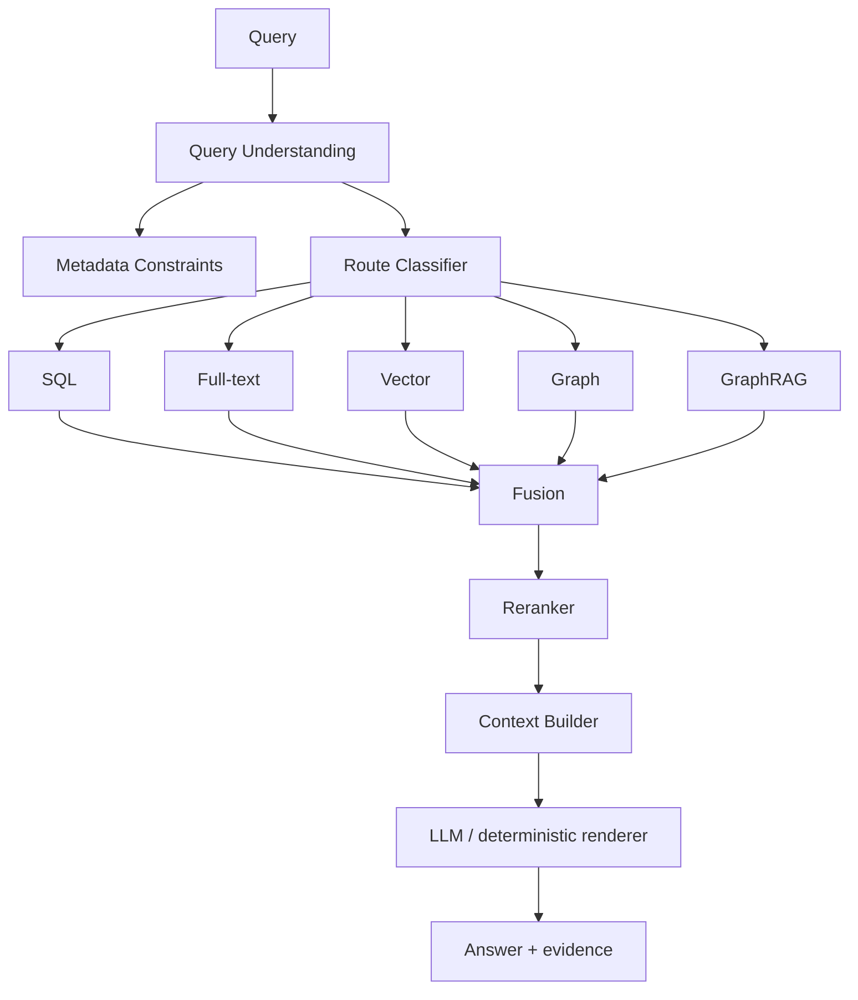

# RAG / Search Design

## 1. 목표

DramaMemory 검색은 “모든 질문을 벡터 검색”으로 해결하지 않는다.

사용자 질의를 다음 축으로 분해한다.

```text
Exact       정확한 제목/배우/연도
Lexical     철자/부분 이름
Semantic    분위기/기억
Relational  배우-작품-OST 관계
Global      시대/테마 전체 경향
Personal    사용자 시청 기록
```

각 질의에 가장 저렴하고 정확한 retrieval path를 선택한다.

---

## 구현 현황 (2026-09-27, `apps/ai-api`)

| 설계 항목 | 구현 | 위치 |
|---|---|---|
| §4 Query Understanding | 결정적 규칙: 연도(`2016년`, `16년쯤`±1, `2010년대 초반`, `90년대 후반`), 방송사 별칭, 필러/조사 제거. LLM 추출기는 같은 `QueryPlan` 뒤로 교체 가능 | `retrieval/query.py` |
| §5.2 Full-text | `websearch_to_tsquery('simple')`, title/alias weight A, body weight B + `pg_trgm` 부분 일치 | `retrieval/store.py` |
| §5.3 Vector | BGE-M3(1024, cosine, normalized) + pgvector HNSW. 임베딩은 `embedding_refresh` DAG가 ai-api `/internal/embed`로 생성 | V11, `store.py`, DAG |
| §6 Fusion | RRF k=60, 리스트별 rank/raw score를 evidence로 응답에 포함 | `retrieval/fusion.py` |
| §7 Metadata-aware | 연도 범위·방송사 필터를 세 retriever 모두에 동일 적용, 조건만 있는 질의는 filter-only | `hybrid.py` |
| §8 Reranking | 미구현 (DM-605) | — |
| §9~§10 Context/Answer | 미구현 (DM-703~706) — `/v1/search`는 retrieval-only | — |
| §15 Versioning | `retrieval_version`, `embedding_model`을 응답과 eval 보고서에 기록 | `config.py` |
| §18 Evaluation | 골든 37 질의 / 7 클래스, lexical·vector·hybrid 비교 보고서 | `evals/retrieval/` |

측정 (24편 카탈로그, 골든 120질의 / 7클래스, `evals/retrieval/reports/latest.json`):

| retriever | recall@1 | recall@5 | MRR | p50 |
|---|---|---|---|---|
| lexical (domain-api, FTS AND + trigram) | 0.524 | 0.554 | 0.562 | 10ms |
| vector only (BGE-M3) | 0.754 | 0.914 | 0.861 | 70ms |
| **hybrid (FTS AND + FTS OR + trigram + vector, RRF)** | **0.889** | **0.992** | **0.968** | 80ms |

평가가 잡아낸 결함과 수정: ① 제목 속 숫자(`응답하라 1988`, `88년 쌍문동`)를 연도 필터로 오해 → 조건으로 0건이면 **조건을 풀고 재검색**(`relaxed`) ② `노희경 작가`처럼 문서에 없는 단어 하나로 AND-FTS 전체 실패 → **OR-FTS 리스트** 추가. 남은 실패 1건(`군인이랑 의사가 전쟁터에서 사랑하는 드라마` → 닥터스 우선)은 reranker(DM-605) 후보. 카탈로그 확대 시 골든셋 200+로 재측정.

---

# 2. Query Taxonomy

## Q1. Structured

> “2016년 tvN 드라마”

정답:

```text
SQL
```

LLM 생성 불필요.

## Q2. Lexical

> “태양 후예”

정답:

```text
alias + FTS + fuzzy
```

## Q3. Semantic Memory

> “겨울 느낌 나는 판타지 로맨스인데 남주가 불멸이었던 것 같아”

정답:

```text
metadata extraction
+ vector
+ lexical
+ rerank
```

## Q4. Multi-hop

> “공유랑 이동욱이 같이 나온 드라마의 OST 가수들이 부른 다른 드라마 OST”

정답:

```text
graph traversal
```

## Q5. Graph + Semantic

> “응답하라 1988 주변의 가족 중심 작품들을 당시 배우 관계까지 연결해서 설명해줘”

정답 후보:

```text
graph neighborhood
+ semantic retrieval
+ optional GraphRAG Local/DRIFT
```

## Q6. Corpus-wide

> “2010년대 한국 드라마에서 반복적으로 나타나는 대표적인 테마를 작품군과 함께 설명해줘”

정답 후보:

```text
GraphRAG Global
```

이 기능은 충분한 editorial corpus가 쌓인 뒤 제공한다.

---

# 3. Architecture



---

# 4. Query Understanding

LLM을 쓰더라도 output은 schema로 제한한다.

```json
{
  "intent": "FIND_DRAMA",
  "title_hint": null,
  "actors": ["공유"],
  "broadcasters": [],
  "year_from": 2015,
  "year_to": 2017,
  "genres": ["판타지", "로맨스"],
  "semantic_text": "겨울 느낌, 불멸의 남자",
  "needs_graph": false,
  "needs_generation": true
}
```

단순한 query는 rule/parser로 처리할 수 있다.

---

# 5. Retrieval

## 5.1 SQL

강한 filter:

- year
- broadcaster
- actor ID
- genre ID
- availability
- watched state

## 5.2 Full-text

대상:

- title
- aliases
- person
- song
- artist
- keywords

한국어 검색 품질이 기본 PostgreSQL FTS로 부족하면 OpenSearch 도입을 검토한다.

도입 조건:

- 형태소 분석 필요성
- prefix/typo/autocomplete 고도화
- 대규모 lexical traffic

## 5.3 Vector

pgvector HNSW 우선 검토.

문서에 넣을 텍스트는 너무 많은 사실을 반복하지 않는다.

```text
title
aliases
year
broadcaster
genres
main cast
OST
curated synopsis/theme
```

## 5.4 Graph

Neo4j traversal.

```cypher
MATCH (p:Person {canonical_id: $personId})-[:ACTED_IN]->(d:Drama)
RETURN d
ORDER BY d.start_date;
```

---

# 6. Candidate Fusion

검색 시스템마다 score 범위가 다르므로 다음처럼 raw score를 바로 더하지 않는다.

```text
0.8 * cosine + 0.2 * bm25
```

초기 기본은 **Reciprocal Rank Fusion**.

```text
RRF(d) = Σ 1 / (k + rank_i(d))
```

보통 `k`는 실험으로 결정한다.

장점:

- source별 score calibration이 덜 필요
- FTS/vector/graph rank를 안정적으로 결합

이후 학습 데이터가 충분하면 Learning-to-Rank를 검토한다.

---

# 7. Metadata-aware Vector Search

벡터 검색 전에 가능한 filter를 건다.

```sql
SELECT ...
FROM search_document sd
JOIN drama d ON ...
WHERE d.start_date >= '2015-01-01'
  AND d.start_date < '2018-01-01'
ORDER BY sd.embedding <=> :query_embedding
LIMIT 50;
```

filter가 강한 query에 전체 vector universe를 검색하지 않는다.

pgvector ANN + filter recall은 실제 데이터로 benchmark한다.

---

# 8. Reranking

reranker는 비용이 있으므로 조건부로 사용한다.

사용 조건:

- semantic query
- fused candidates > 10
- top scores가 근접
- multi-signal ambiguity

input:

```text
query + candidate summary
```

output:

```text
ranked candidate IDs
```

---

# 9. Context Builder

LLM에 raw DB dump를 넘기지 않는다.

```json
{
  "drama": {
    "id": 101,
    "title": "도깨비",
    "year": 2016,
    "broadcaster": "tvN"
  },
  "evidence": [
    {"type": "credit", "person": "공유"},
    {"type": "genre", "value": "판타지"},
    {"type": "source", "source_record_id": 991}
  ],
  "official_links": [...]
}
```

---

# 10. Answer Policy

답변은 retrieved evidence 범위 내에서 생성한다.

모르는 경우:

```text
후보가 충분하지 않습니다.
```

정확한 다시보기 가능 여부는 `streaming_link.availability_status`를 사용한다.

LLM에게 링크를 기억해서 만들게 하지 않는다.

---

# 11. GraphRAG

Microsoft GraphRAG 기준:

- **Basic Search**: baseline vector RAG
- **Local Search**: 특정 entity 중심
- **Global Search**: community report 기반 corpus 전체
- **DRIFT Search**: local + community context 확장

DramaMemory mapping:

| Query | Strategy |
|---|---|
| 정확한 배우 관계 | Neo4j deterministic |
| 배우 주변 설명 | Graph + Local Search |
| 관계가 모호한 thematic search | DRIFT 후보 |
| 시대 전체 theme | Global Search |
| 단순 의미 검색 | Basic/vector |

---

# 12. Canonical Graph vs GraphRAG Graph

둘을 혼동하지 않는다.

## Canonical Graph

검증된 관계:

```text
Person ACTED_IN Drama
Drama HAS_OST Song
Artist PERFORMED Song
Drama AIRED_BY Broadcaster
```

Source: PostgreSQL

## GraphRAG-derived Graph

비정형 텍스트에서 추출된:

```text
theme
claim
soft relation
community
```

예:

```text
Drama --EVOKES--> "청춘의 상실"
Drama --THEMATICALLY_RELATED--> Drama
```

derived edge에는 confidence/source/version이 필요하다.

---

# 13. Personalization

초기에는 LLM recommendation보다 deterministic feature를 먼저 쓴다.

예:

```text
user watched genre frequency
actor overlap
year affinity
broadcaster affinity
```

개인 시청 기록을 public GraphRAG corpus에 섞지 않는다.

---

# 14. Prompt Injection

retrieved document는 instruction이 아니라 **data**로 취급한다.

방어:

- trusted source allowlist
- HTML/script 제거
- context delimiter
- tool call permission 분리
- user content trust level
- model에게 external text instruction을 따르지 말라고 system policy

---

# 15. Versioning

모든 AI answer trace에 저장:

```text
query_normalized
route_version
fts_version
embedding_model
embedding_index_version
graph_projection_version
graphrag_index_version
reranker_version
prompt_version
llm_model
```

---

# 16. Latency Budget

초기 예산:

```text
query parsing       100~300ms
retrieval parallel  100~500ms
fusion              < 20ms
rerank              100~800ms
generation          provider-dependent
```

실측 후 SLO 확정.

---

# 17. Cache

cacheable:

- normalized query result IDs
- graph traversal
- generated answer for public query

non-cache/short TTL:

- personalized query
- rapidly changing official links

---

# 18. Evaluation Before GraphRAG

GraphRAG를 production에 넣기 전에 반드시 baseline을 만든다.

```text
A. FTS
B. Vector
C. FTS + Vector RRF
D. C + Neo4j
E. D + GraphRAG Local/DRIFT
```

E가 query class별 quality/cost 기준을 만족할 때만 유지한다.

---

# 19. References

- GraphRAG Query Overview  
  https://microsoft.github.io/graphrag/query/overview/
- GraphRAG Indexing  
  https://microsoft.github.io/graphrag/index/overview/
- pgvector  
  https://github.com/pgvector/pgvector
